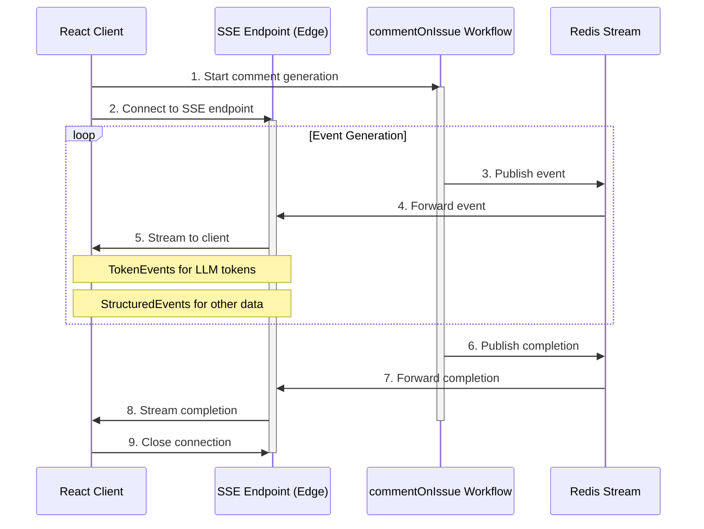

# Streaming Responses Architecture

## Overview

This document outlines the architecture for implementing real-time streaming responses from the `commentOnIssue` workflow to the front-end client.

## System Components

### 1. Backend Components

#### Redis Event Coordinator (Node.js Runtime)

- Uses existing Redis implementation from redis-old.ts, enhanced for streaming
- Pub/Sub based real-time event delivery
- Key structure:
  ```typescript
  // Event channels
  `workflow:${id}` - Pub/Sub channel for real-time events
  `workflow:${id}:history` - List of events for race condition handling
  `workflow:${id}:metadata` - Workflow metadata
  ```
- Methods:

  ```typescript
  // Publisher (Node.js Runtime)
  async function publishEvent(workflowId: string, event: WorkflowEvent) {
    // Store in history first to handle race conditions
    await redis.lpush(`workflow:${workflowId}:history`, JSON.stringify(event))
    // Then publish for real-time subscribers
    await redis.publish(`workflow:${workflowId}`, JSON.stringify(event))
  }

  // Subscriber (Edge Runtime)
  async function subscribeToEvents(workflowId: string) {
    const subscriber = redis.duplicate()
    await subscriber.subscribe(`workflow:${workflowId}`)
    return subscriber
  }
  ```

Note: History storage in Redis is crucial for handling race conditions. Since the workflow starts generating events immediately after creation, but the client might take some time to establish the SSE connection, we need to store events temporarily. This ensures no events are lost between workflow start and client connection. History can be cleared after workflow completion or after persistence to long-term storage (e.g., Postgres in the future).

#### SSE Endpoint (Edge Runtime)

- Uses TransformStream for efficient event delivery
- Connects to Redis Pub/Sub for real-time events
- Handles both:
  1. Initial history replay from Redis lists (catches up on missed events)
  2. Real-time events from Pub/Sub (for new events)
- No OpenAI SDK dependency (Edge compatible)

#### commentOnIssue Workflow (Node.js Runtime)

- Handles the core business logic
- Emits events through WorkflowEventEmitter
- Manages workflow lifecycle:
  - Initialization
  - Progress updates
  - Error handling
  - Completion
- Returns structured WorkflowResult

### 2. Frontend Components

#### StreamHandler React Component ✅

- Location: `components/StreamHandler.tsx`
- Props:
  ```typescript
  interface StreamHandlerProps {
    workflowId: string
    onComplete?: (content: string) => void
    onError?: (error: Error) => void
    className?: string
  }
  ```
- Features:
  - Manages streaming state with React hooks
  - Simulates streaming with mock data (Stage 1)
  - Provides Start/Stop controls
  - Displays real-time content updates
  - Handles cleanup on unmount
  - Supports error handling and completion callbacks
- UI Components:
  - Control button with dynamic state
  - Content display area with monospace font
  - Workflow ID display
  - Clean, responsive layout with Tailwind CSS

### 3. Type Definitions

```typescript
// Base type for all stream events
interface BaseStreamEvent {
  type: string // Extensible event type
  data: unknown // Flexible payload type
}

// Lightweight event for LLM tokens
interface TokenEvent extends BaseStreamEvent {
  type: "token"
  data: string // Just the token content
}

// For events requiring more structure
interface StructuredEvent extends BaseStreamEvent {
  id?: string // Optional ID for events that need reference
  timestamp?: number // Only when timing is relevant
  metadata?: Record<string, unknown> // Optional metadata when needed
}
```

### 4. Data Flow



## NextJS Runtime Considerations

### Edge Runtime Components

- SSE endpoint (`app/api/workflows/[workflowId]/events/route.ts`)
  - Lightweight, stateless handling of SSE connections
  - Optimized for real-time streaming
  - Limited to Edge-compatible APIs

### Node.js Runtime Components

- WorkflowEventEmitter service
  - Full access to Node.js EventEmitter functionality
  - Maintains subscriber state
- commentOnIssue workflow
  - Complex processing capabilities
  - Access to full Node.js APIs and dependencies

## Implementation Guidelines

### 1. Error Handling

- Proper error propagation through event system
- Automatic cleanup of resources on error
- Clear error messaging to client

### 2. Memory Management

- Cleanup of completed workflow subscribers
- Proper closing of SSE connections
- Garbage collection of unused workflow instances

### 3. Security Considerations

- Authenticate SSE connections
- Validate workflowId to prevent unauthorized access
- Rate limiting for connection attempts
- Timeout mechanisms for stale connections

### 4. Performance Optimization

- Connection pooling for multiple clients
- Efficient event propagation
- Proper cleanup of completed workflow resources

## Usage Example

```typescript
// In your React component:
function CommentPage() {
  const handleComplete = (content: string) => {
    console.log('Comment generation completed:', content);
  };

  const handleError = (error: Error) => {
    console.error('Error:', error);
  };

  return (
    <StreamHandler
      workflowId="some-workflow-id"
      onComplete={handleComplete}
      onError={handleError}
      className="prose"
    />
  );
}
```

### LLM Token Streaming

#### Event Types

```typescript
interface TokenEvent extends BaseEvent {
  type: "token"
  data: {
    content: string
    isComplete: boolean
    metadata?: {
      finishReason?: string
      usage?: TokenUsage
    }
  }
}
```

#### Token Processing

- TransformStream handles token chunking and formatting
- Redis stores complete history for replay/recovery
- Edge runtime manages backpressure and client connections

## Runtime Considerations

### Edge Runtime (SSE Endpoint)

- Handles client connections via TransformStream
- Subscribes to Redis Pub/Sub for real-time updates
- Serves events to clients with minimal latency
- No heavy dependencies

### Node.js Runtime (Workflow Processing)

- Handles LLM interactions via OpenAI SDK
- Manages workflow business logic
- Publishes events through Redis Pub/Sub
- Maintains event history

### Redis (State Coordination)

- Single source of truth for events
- Coordinates between runtimes
- Handles subscriber management
- Provides event persistence

```

```

```

```
