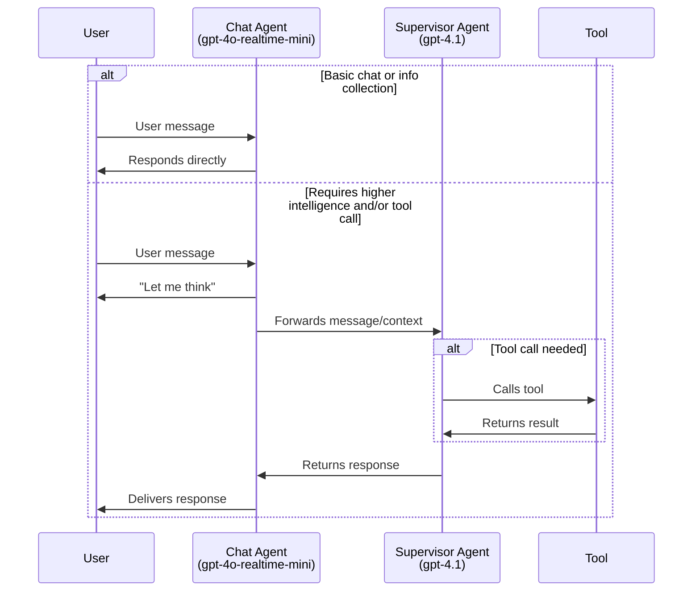
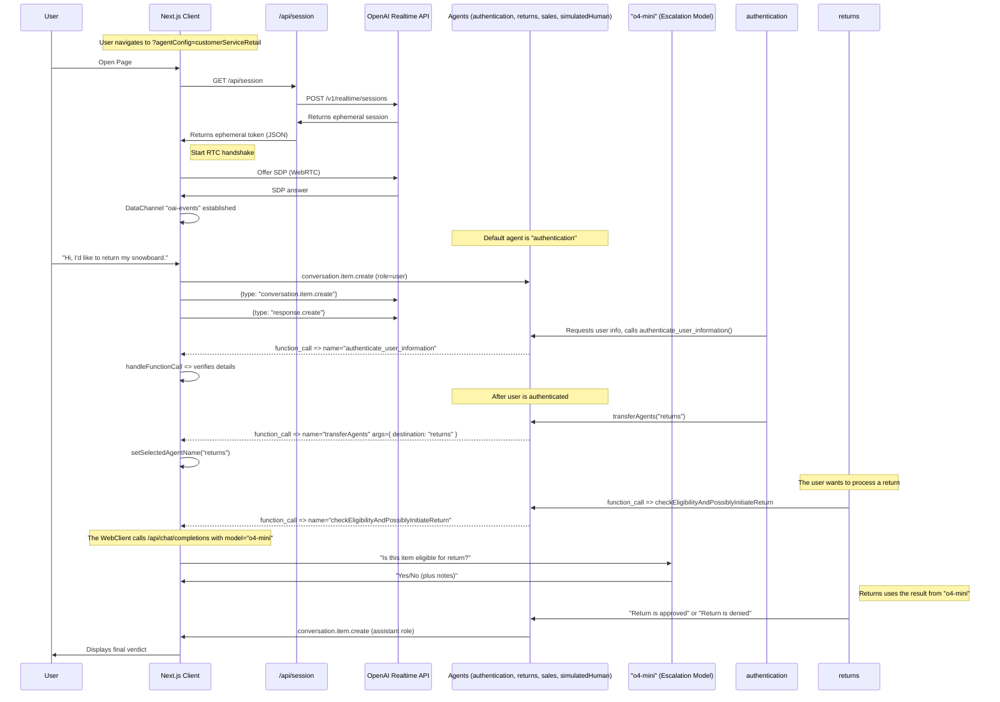

# Realtime API Agents Demo

This is a demonstration of more advanced patterns for voice agents, using the OpenAI Realtime API and the OpenAI Agents SDK. 

## About the OpenAI Agents SDK

This project uses the [OpenAI Agents SDK](https://github.com/openai/openai-agents-js), a toolkit for building, managing, and deploying advanced AI agents. The SDK provides:

- A unified interface for defining agent behaviors and tool integrations.
- Built-in support for agent orchestration, state management, and event handling.
- Easy integration with the OpenAI Realtime API for low-latency, streaming interactions.
- Extensible patterns for multi-agent collaboration, handoffs, tool use, and guardrails.

For full documentation, guides, and API references, see the official [OpenAI Agents SDK Documentation](https://github.com/openai/openai-agents-js#readme).

**NOTE:** For a version that does not use the OpenAI Agents SDK, see the [branch without-agents-sdk](https://github.com/openai/openai-realtime-agents/tree/without-agents-sdk).

There are two main patterns demonstrated:
1. **Chat-Supervisor:** A realtime-based chat agent interacts with the user and handles basic tasks, while a more intelligent, text-based supervisor model (e.g., `gpt-4.1`) is used extensively for tool calls and more complex responses. This approach provides an easy onramp and high-quality answers, with a small increase in latency.
2. **Sequential Handoff:** Specialized agents (powered by realtime api) transfer the user between them to handle specific user intents. This is great for customer service, where user intents can be handled sequentially by specialist models that excel in a specific domains. This helps avoid the model having all instructions and tools in a single agent, which can degrade performance.

## Setup

- This is a Next.js typescript app. Install dependencies with `npm i`.
- Add your `OPENAI_API_KEY` to your env. Either add it to your `.bash_profile` or equivalent, or copy `.env.sample` to `.env` and add it there.
- Start the server with `npm run dev`
- Open your browser to [http://localhost:3000](http://localhost:3000). It should default to the `chatSupervisor` Agent Config.
- You can change examples via the "Scenario" dropdown in the top right.

# Agentic Pattern 1: Chat-Supervisor

This is demonstrated in the [chatSupervisor](src/app/agentConfigs/chatSupervisor/index.ts) Agent Config. The chat agent uses the realtime model to converse with the user and handle basic tasks, like greeting the user, casual conversation, and collecting information, and a more intelligent, text-based supervisor model (e.g. `gpt-4.1`) is used extensively to handle tool calls and more challenging responses. You can control the decision boundary by "opting in" specific tasks to the chat agent as desired.

Video walkthrough: [https://x.com/noahmacca/status/1927014156152058075](https://x.com/noahmacca/status/1927014156152058075)

## Example

*In this exchange, note the immediate response to collect the phone number, and the deferral to the supervisor agent to handle the tool call and formulate the response. There ~2s between the end of "give me a moment to check on that." being spoken aloud and the start of the "Thanks for waiting. Your last bill...".*

## Schematic


## Benefits
- **Simpler onboarding.** If you already have a performant text-based chat agent, you can give that same prompt and set of tools to the supervisor agent, and make some tweaks to the chat agent prompt, you'll have a natural voice agent that will perform on par with your text agent.
- **Simple ramp to a full realtime agent**: Rather than switching your whole agent to the realtime api, you can move one task at a time, taking time to validate and build trust for each before deploying to production.
- **High intelligence**: You benefit from the high intelligence, excellent tool calling and instruction following of models like `gpt-4.1` in your voice agents.
- **Lower cost**: If your chat agent is only being used for basic tasks, you can use the realtime-mini model, which, even when combined with GPT-4.1, should be cheaper than using the full 4o-realtime model.
- **User experience**: It's a more natural conversational experience than using a stitched model architecture, where response latency is often 1.5s or longer after a user has finished speaking. In this architecture, the model responds to the user right away, even if it has to lean on the supervisor agent.
  - However, more assistant responses will start with "Let me think", rather than responding immediately with the full response.

## Modifying for your own agent
1. Update [supervisorAgent](src/app/agentConfigs/chatSupervisorDemo/supervisorAgent.ts).
  - Add your existing text agent prompt and tools if you already have them. This should contain the "meat" of your voice agent logic and be very specific with what it should/shouldn't do and how exactly it should respond. Add this information below `==== Domain-Specific Agent Instructions ====`.
  - You should likely update this prompt to be more appropriate for voice, for example with instructions to be concise and avoiding long lists of items.
2. Update [chatAgent](src/app/agentConfigs/chatSupervisor/index.ts).
  - Customize the chatAgent instructions with your own tone, greeting, etc.
  - Add your tool definitions to `chatAgentInstructions`. We recommend a brief yaml description rather than json to ensure the model doesn't get confused and try calling the tool directly.
  - You can modify the decision boundary by adding new items to the `# Allow List of Permitted Actions` section.
3. To reduce cost, try using `gpt-4o-mini-realtime` for the chatAgent and/or `gpt-4.1-mini` for the supervisor model. To maximize intelligence on particularly difficult or high-stakes tasks, consider trading off latency and adding chain-of-thought to your supervisor prompt, or using an additional reasoning model-based supervisor that uses `o4-mini`.

# Agentic Pattern 2: Sequential Handoffs

This pattern is inspired by [OpenAI Swarm](https://github.com/openai/swarm) and involves the sequential handoff of a user between specialized agents. Handoffs are decided by the model and coordinated via tool calls, and possible handoffs are defined explicitly in an agent graph. A handoff triggers a session.update event with new instructions and tools. This pattern is effective for handling a variety of user intents with specialist agents, each of which might have long instructions and numerous tools.

Here's a [video walkthrough](https://x.com/OpenAIDevs/status/1880306081517432936) showing how it works. You should be able to use this repo to prototype your own multi-agent realtime voice app in less than 20 minutes!


*In this simple example, the user is transferred from a greeter agent to a haiku agent. See below for the simple, full configuration of this flow.*

Configuration in `src/app/agentConfigs/simpleExample.ts`
```typescript
import { RealtimeAgent } from '@openai/agents/realtime';

// Define agents using the OpenAI Agents SDK
export const haikuWriterAgent = new RealtimeAgent({
  name: 'haikuWriter',
  handoffDescription: 'Agent that writes haikus.', // Context for the agent_transfer tool
  instructions:
    'Ask the user for a topic, then reply with a haiku about that topic.',
  tools: [],
  handoffs: [],
});

export const greeterAgent = new RealtimeAgent({
  name: 'greeter',
  handoffDescription: 'Agent that greets the user.',
  instructions:
    "Please greet the user and ask them if they'd like a haiku. If yes, hand off to the 'haikuWriter' agent.",
  tools: [],
  handoffs: [haikuWriterAgent], // Define which agents this agent can hand off to
});

// An Agent Set is just an array of the agents that participate in the scenario
export default [greeterAgent, haikuWriterAgent];
```
## CustomerServiceRetail Flow

This is a more complex, representative implementation that illustrates a customer service flow, with the following features:
- A more complex agent graph with agents for user authentication, returns, sales, and a placeholder human agent for escalations.
- An escalation by the [returns](https://github.com/openai/openai-realtime-agents/blob/60f4effc50a539b19b2f1fa4c38846086b58c295/src/app/agentConfigs/customerServiceRetail/returns.ts#L233) agent to `o4-mini` to validate and initiate a return, as an example high-stakes decision, using a similar pattern to the above.
- Prompting models to follow a state machine, for example to accurately collect things like names and phone numbers with confirmation character by character to authenticate a user.
  - To test this flow, say that you'd like to return your snowboard and go through the necessary prompts!

Configuration in [src/app/agentConfigs/customerServiceRetail/index.ts](src/app/agentConfigs/customerServiceRetail/index.ts).
```javascript
import authentication from "./authentication";
import returns from "./returns";
import sales from "./sales";
import simulatedHuman from "./simulatedHuman";
import { injectTransferTools } from "../utils";

authentication.downstreamAgents = [returns, sales, simulatedHuman];
returns.downstreamAgents = [authentication, sales, simulatedHuman];
sales.downstreamAgents = [authentication, returns, simulatedHuman];
simulatedHuman.downstreamAgents = [authentication, returns, sales];

const agents = injectTransferTools([
  authentication,
  returns,
  sales,
  simulatedHuman,
]);

export default agents;
```

## Schematic

This diagram illustrates a more advanced interaction flow defined in `src/app/agentConfigs/customerServiceRetail/`, including detailed events.

<details>
<summary><strong>Show CustomerServiceRetail Flow Diagram</strong></summary>



</details>

# Other Info
## Next Steps
- You can copy these templates to make your own multi-agent voice app! Once you make a new agent set config, add it to `src/app/agentConfigs/index.ts` and you should be able to select it in the UI in the "Scenario" dropdown menu.
- Each agentConfig can define instructions, tools, and toolLogic. By default all tool calls simply return `True`, unless you define the toolLogic, which will run your specific tool logic and return an object to the conversation (e.g. for retrieved RAG context).
- If you want help creating your own prompt using the conventions shown in customerServiceRetail, including defining a state machine, we've included a metaprompt [here](src/app/agentConfigs/voiceAgentMetaprompt.txt), or you can use our [Voice Agent Metaprompter GPT](https://chatgpt.com/g/g-678865c9fb5c81918fa28699735dd08e-voice-agent-metaprompt-gpt)

## Output Guardrails
Assistant messages are checked for safety and compliance before they are shown in the UI.  The guardrail call now lives directly inside `src/app/App.tsx`: when a `response.text.delta` stream starts we mark the message as **IN_PROGRESS**, and once the server emits `guardrail_tripped` or `response.done` we mark the message as **FAIL** or **PASS** respectively.  If you want to change how moderation is triggered or displayed, search for `guardrail_tripped` inside `App.tsx` and tweak the logic there.

## Navigating the UI
- You can select agent scenarios in the Scenario dropdown, and automatically switch to a specific agent with the Agent dropdown.
- The conversation transcript is on the left, including tool calls, tool call responses, and agent changes. Click to expand non-message elements.
- The event log is on the right, showing both client and server events. Click to see the full payload.
- On the bottom, you can disconnect, toggle between automated voice-activity detection or PTT, turn off audio playback, and toggle logs.

## Pull Requests

Feel free to open an issue or pull request and we'll do our best to review it. The spirit of this repo is to demonstrate the core logic for new agentic flows; PRs that go beyond this core scope will likely not be merged.

# Core Contributors
- Noah MacCallum - [noahmacca](https://x.com/noahmacca)
- Ilan Bigio - [ibigio](https://github.com/ibigio)
- Brian Fioca - [bfioca](https://github.com/bfioca)
