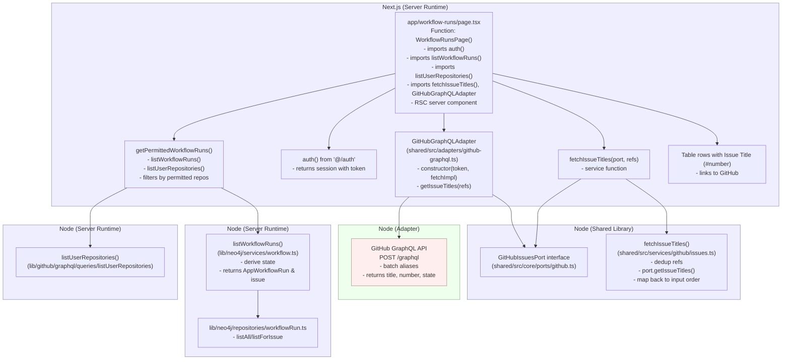

## Workflow Runs: Issue Title Fetching Architecture

This document shows the flow for rendering issue titles in the workflow runs list, including runtime boundaries and dependency injection.

### Notes

- Token injection occurs in `app/workflow-runs/page.tsx` via `auth()` and is passed to `GitHubGraphQLAdapter`.
- Shared services and ports are framework-agnostic and do not rely on Next.js.
- The adapter exposes a minimal fetch contract and can be provided any compatible fetch implementation.
