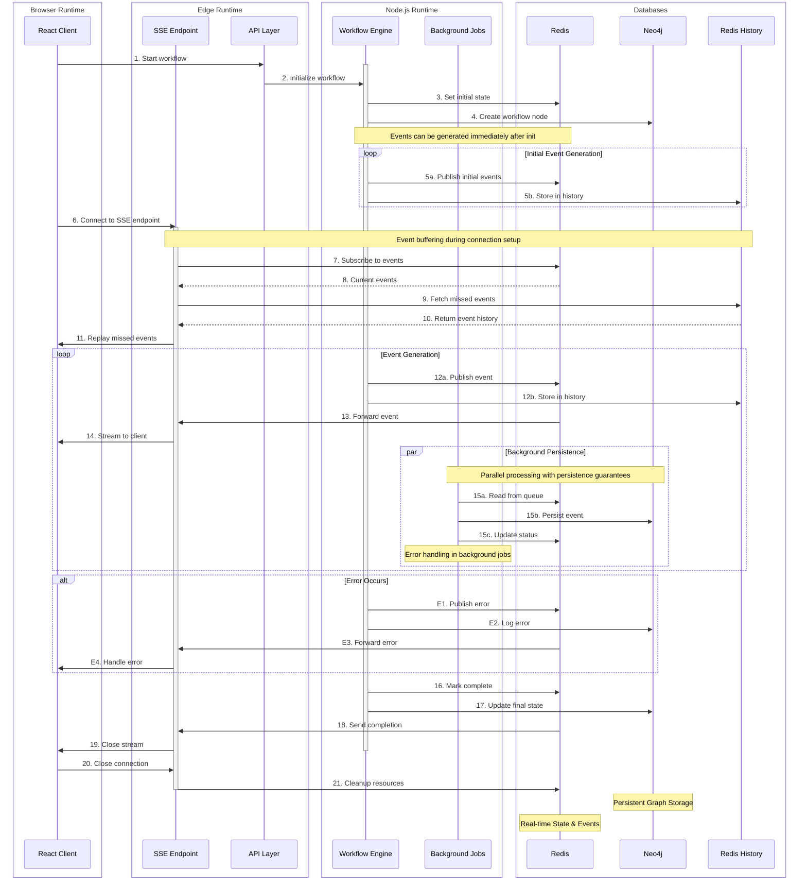

```mermaid
sequenceDiagram
    box Browser Runtime
        participant Client as React Client
    end

    box Edge Runtime
        participant SSE as SSE Endpoint
        participant API as API Layer
    end

    box Node.js Runtime
        participant Workflow as Workflow Engine
        participant Background as Background Jobs
    end

    box Databases
        participant Redis as Redis
        participant Neo4j as Neo4j
        participant History as Redis History
    end

    Client->>API: 1. Start workflow
    activate Workflow

    API->>Workflow: 2. Initialize workflow
    Workflow->>Redis: 3. Set initial state
    Workflow->>Neo4j: 4. Create workflow node

    note over Workflow,Redis: Events can be generated immediately after init

    loop Initial Event Generation
        Workflow->>Redis: 5a. Publish initial events
        Workflow->>History: 5b. Store in history
    end

    Client->>SSE: 6. Connect to SSE endpoint
    activate SSE

    note over SSE,History: Event buffering during connection setup

    SSE->>Redis: 7. Subscribe to events
    Redis-->>SSE: 8. Current events

    SSE->>History: 9. Fetch missed events
    History-->>SSE: 10. Return event history
    SSE->>Client: 11. Replay missed events

    loop Event Generation
        Workflow->>Redis: 12a. Publish event
        Workflow->>History: 12b. Store in history
        Redis->>SSE: 13. Forward event
        SSE->>Client: 14. Stream to client

        par Background Persistence
            note over Background,Neo4j: Parallel processing with persistence guarantees
            Background->>Redis: 15a. Read from queue
            Background->>Neo4j: 15b. Persist event
            Background->>Redis: 15c. Update status
            note over Background: Error handling in background jobs
        end
    end

    alt Error Occurs
        Workflow->>Redis: E1. Publish error
        Workflow->>Neo4j: E2. Log error
        Redis->>SSE: E3. Forward error
        SSE->>Client: E4. Handle error
    end

    Workflow->>Redis: 16. Mark complete
    Workflow->>Neo4j: 17. Update final state
    Redis->>SSE: 18. Send completion
    SSE->>Client: 19. Close stream
    deactivate Workflow

    Client->>SSE: 20. Close connection
    SSE->>Redis: 21. Cleanup resources
    deactivate SSE

    note over Neo4j: Persistent Graph Storage
    note over Redis: Real-time State & Events
```
