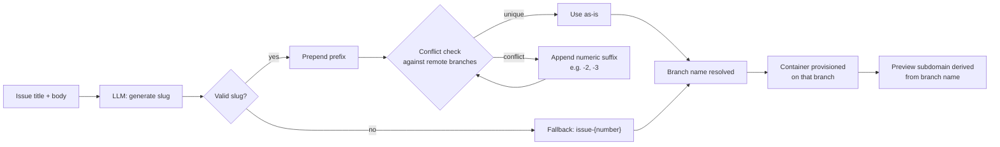
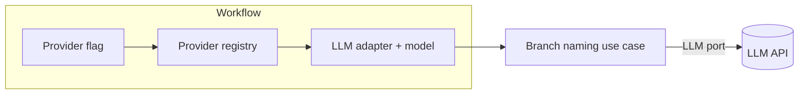

# Branch Naming — Technical Architecture

## Pipeline overview

Branch name generation is a discrete use case that runs early in the resolve-issue workflow, before a container is provisioned. The output feeds directly into container setup, so the branch name must be resolved before any other work begins.

## Inputs and outputs

| Input | Description |
|---|---|
| Issue title and body | Passed as plain text context to the LLM |
| Prefix | A short category label, e.g. `feature`, prepended with a slash separator |
| Existing remote branches | Fetched from the GitHub Refs port; used for conflict detection |

Output: a single branch name string, guaranteed to be unique among current remote branches at the time of generation.

## Prefix selection

The current implementation always uses `feature/` as the prefix. Ideally, the prefix should be determined dynamically — either by the LLM based on issue context or by inspecting issue labels — to select an appropriate prefix such as `feature/`, `fix/`, or `chore/`. This is an area for improvement.

## Slug validation

The raw LLM output is normalized before use. The normalization rules enforce valid Git ref characters: spaces and underscores become hyphens, invalid characters are stripped, leading/trailing hyphens and dots are removed, and consecutive hyphens are collapsed. A bare `@` is replaced with `at`. If the result is empty after normalization, the slug defaults to `new-branch`.

## Fallback behavior

If branch name generation fails entirely (e.g., LLM API error), the workflow falls back to `issue-{number}` where `{number}` is the GitHub issue number. The workflow never falls back to the repository's default branch (e.g., `main`) to prevent accidental commits to protected branches.

## Conflict resolution

The use case checks the proposed name against the set of existing remote branches. If the name is taken, it increments a numeric suffix starting at 2. After a configured maximum number of attempts, it appends a timestamp. In the extremely unlikely case that also collides, a random alphanumeric suffix is used.

## User naming preferences (planned)

The branch naming pipeline should eventually accept an optional user-provided naming instruction in natural language. This instruction would be appended to the LLM prompt, allowing users to customize the naming convention (e.g., "always include the issue number", "use jira ticket IDs as prefix"). The use case already accepts injected dependencies, so this would be an additional optional parameter on the input interface.

## Provider routing

Currently, LLM provider selection for branch name generation happens inline in the workflow: a provider flag selects either the Anthropic or OpenAI adapter, and a hardcoded model name is passed for each.

The ideal architecture is a provider config registry — a central map from provider identifier to adapter factory and default model — so that adding a new provider requires only a single entry point rather than scattered if-else checks across workflow files. The branch naming use case itself is already provider-agnostic: it accepts an injected LLM port and does not know which model is behind it.

## Connection to preview deployment

After the branch name is resolved, it is combined with the repository owner and repo name to form a subdomain slug for the preview container. The slug is composed as `<branch>-<owner>-<repo>`, normalized to URL-safe characters, and trimmed to fit within the 63-character DNS label limit. If the full slug exceeds the soft limit of 55 characters, only the branch segment is truncated and a short unique suffix is appended to avoid collisions.

This means a descriptive, concise branch name directly produces a more readable preview URL.

## Key design constraints

- Branch naming runs before container provisioning. The branch name cannot be changed once the container is started.
- The use case must not import any specific LLM adapter. All provider dependencies are injected by the caller.
- The conflict check queries GitHub at the moment of generation. There is a small race window if another process creates the same branch between the check and the push — this is considered acceptable for the current scale.
