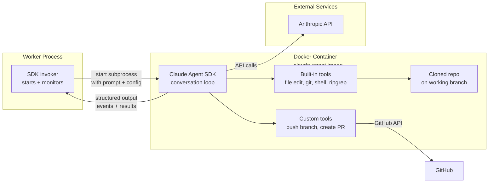

# Claude Agent SDK Runtime

Parent doc: [`docs/dev/multi-model-support.md`](multi-model-support.md)

> This doc describes how Anthropic Claude models operate within the issue-to-pr infrastructure using the Claude Agent SDK.

## Runtime pattern: In-container agent

The Claude agent follows the **in-container agent pattern** — the SDK runs as a subprocess inside the Docker container, operating directly on the filesystem. The worker process starts the SDK and collects its output, but does not manage the conversation loop.

## How it works

1. **Worker creates container** from a `claude-agent` image — the generic `agent-base` image extended with the Claude Agent SDK (`@anthropic-ai/claude-code`) pre-installed.

2. **Worker invokes the SDK** inside the container as a subprocess, passing:
   - The prompt (issue details, codebase context)
   - The system instructions (coding standards, PR workflow)
   - The user's Anthropic API key (via `ANTHROPIC_API_KEY` env var)
   - Custom tool definitions for GitHub operations

3. **SDK runs its own conversation loop**: The SDK manages the full agentic loop internally — calling the Anthropic API, executing tools, handling retries. We do not implement the loop.

4. **Built-in tools**: The SDK natively handles file reading, file editing, git operations, shell commands, and code search. These operate directly on the container filesystem — no `docker exec` needed since the SDK is already inside the container.

5. **Custom tools**: We provide additional tools to the SDK for operations it can't do natively:
   - Push branch to GitHub (requires authenticated remote URL)
   - Create pull request (requires GitHub API access)

6. **Output collection**: The worker collects structured output from the SDK subprocess — conversation turns, tool calls, results, token usage — and maps them to our event schema.

## Custom tools

The SDK handles most operations natively. We only add tools for GitHub-specific operations:

| Tool | What it does | How provided |
|---|---|---|
| `sync_branch_to_remote` | Push branch to GitHub | MCP tool or custom tool definition |
| `create_pull_request` | Open PR, link issue, label | MCP tool or custom tool definition |

Everything else (file I/O, git, shell, search) is handled by the SDK's built-in capabilities.

## Docker image

Requires a dedicated `claude-agent` image that extends `agent-base` with:
- Claude Agent SDK (`@anthropic-ai/claude-code`) installed globally
- Any SDK dependencies

This image is built and published alongside the existing `agent-base` image.

## API key injection

The user's Anthropic API key is set as the `ANTHROPIC_API_KEY` environment variable when starting the SDK subprocess inside the container. It is scoped to that container's lifetime and never persisted to disk.

## Differences from the OpenAI runtime

| Aspect | OpenAI | Claude SDK |
|---|---|---|
| Agent loop location | Worker process | Inside container |
| Tool implementation | Our codebase (10+ tools) | SDK built-in (most) + 2 custom |
| Docker image | `agent-base` (generic) | `claude-agent` (SDK pre-installed) |
| API key location | Worker process memory | Container env var |
| File operations | Via docker exec from worker | Direct filesystem access in container |
| Conversation management | Our code manages turns | SDK manages internally |
