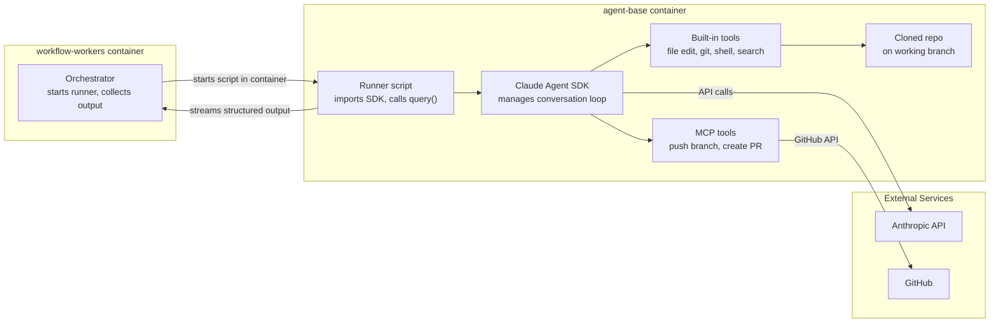

# Claude Agent SDK Runtime

Parent doc: [`docs/dev/multi-model-support.md`](multi-model-support.md)

> This doc describes how Anthropic Claude models operate within the issue-to-pr infrastructure using the Claude Agent SDK.

## Runtime pattern: In-container agent

The Claude agent follows the **in-container agent pattern** — a runner script inside the agent-base container imports the SDK and calls `query()`. The SDK manages the full agentic loop, operating directly on the container filesystem. The workflow-workers process starts and monitors this runner but does not manage the conversation loop.

## How it works

1. **Single Docker image** — The Claude Agent SDK (`@anthropic-ai/claude-agent-sdk`) is pre-installed in the `agent-base` image alongside all existing tools. There is no separate Claude-specific image. See [`docs/dev/containers.md`](containers.md) for container lifecycle details.

2. **Runner script inside the container** — The workflow-workers orchestrator starts a Node.js script inside the agent-base container. This script imports the SDK and calls `query()`, passing the prompt, system instructions, and tool definitions. The SDK owns the conversation loop and streams back messages via an async iterator. The orchestrator collects this output.

3. **API key** — The user's Anthropic API key is injected as the `ANTHROPIC_API_KEY` environment variable into the agent-base container. The SDK picks it up automatically. There is no programmatic key parameter on `query()`.

4. **SDK version** — The SDK is pinned to a specific version in the Dockerfile and `package.json`. Do not use `latest`.

5. **Built-in tools** — The SDK natively handles file reading, file editing, git operations, shell commands, and code search. These operate directly on the container filesystem — no `docker exec` needed since the SDK is already inside the container.

6. **MCP tools** — GitHub-specific operations (push branch, create PR) are provided as MCP tools. These have tighter access controls — never push to main by default, always create a new branch. See [`docs/dev/tools.md`](tools.md) for tool definitions and permission model.

7. **Output collection** — The orchestrator reads the structured output stream from the runner script and maps events to our Neo4j workflow event schema, the same way OpenAI events are handled today.

## System prompt

The system prompt should be minimal and should not override any `CLAUDE.md` files present in the code repository. Use the preset approach with workflow-specific context appended (e.g., "the user expects you to finish by creating a PR"). Avoid duplicating instructions that the SDK already handles by default.

## Session persistence

The SDK automatically persists conversation sessions to disk as JSONL at `~/.claude/projects/<encoded-cwd>/<session-id>.jsonl`. Sessions can be resumed by ID. We store session references in Neo4j and load session history into warm containers to resume interrupted work.

## Permission model

Unrestricted file and shell access inside the container sandbox is acceptable — the container is already isolated. The tighter controls apply to outbound GitHub operations (push, PR creation), which are gated through MCP tools rather than raw shell access.

## Error propagation

Anthropic API errors caught from the `query()` iterator are propagated to Neo4j workflow events, consistent with how OpenAI errors are handled today.

## Differences from the OpenAI runtime

| Aspect | OpenAI | Claude SDK |
|---|---|---|
| Agent loop location | workflow-workers process (our code) | Inside agent-base container (SDK-managed) |
| Tool implementation | Our codebase (10+ tools) | SDK built-in (most) + MCP tools |
| Docker image | `agent-base` | `agent-base` (same image, SDK pre-installed) |
| API key | Worker process memory | Container env var (`ANTHROPIC_API_KEY`) |
| File operations | Via `docker exec` from worker | Direct filesystem access inside container |
| Conversation management | Our code manages turns | SDK manages internally via `query()` |
| Session persistence | Not applicable | JSONL on disk, resumable by session ID |
