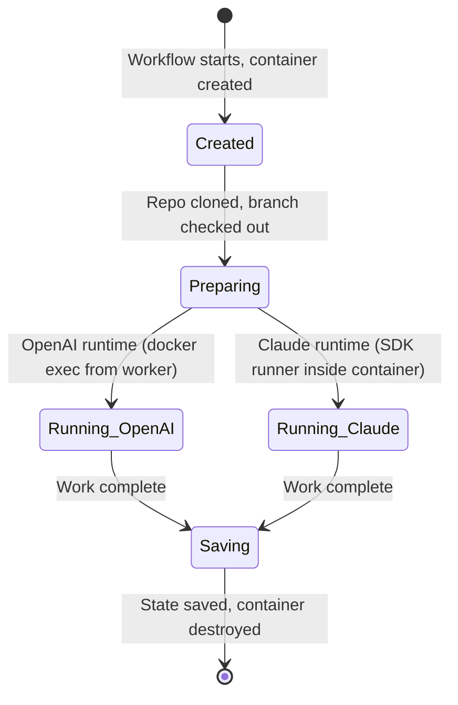
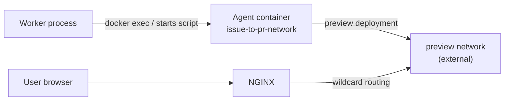

# Container Lifecycle and Management

Parent doc: [`docs/dev/multi-model-support.md`](multi-model-support.md)

> This doc describes the **ideal state** of the system — the architecture we're building toward. It may not reflect the current implementation.

## Overview

Every workflow run executes inside an ephemeral Docker container. Containers act as disposable sandboxes: the agent can read, write, and execute anything inside — that is safe by design. The security boundary is not the filesystem; it is external actions (GitHub pushes, PR creation, third-party API calls), which are gated by custom tools with explicit permission policies. See [`docs/dev/tools.md`](tools.md).

## Combined image

A single `agent-base` image serves both the OpenAI and Claude agent runtimes.

| Layer | Contents |
|---|---|
| Base OS | Debian bookworm-slim |
| Language runtimes | Node.js 22, Python 3.11, pnpm |
| Developer tools | git, ripgrep, tree, curl |
| Claude Agent SDK | `@anthropic-ai/claude-agent-sdk` (pinned version) |

The Claude Agent SDK is pre-installed even though OpenAI workflows do not invoke it. This eliminates the complexity of maintaining two images and routing between them at container creation time. The SDK is dormant in OpenAI containers — it adds image size, nothing else.

The SDK version is pinned so that image builds are reproducible and SDK upgrades are explicit, deliberate changes.

Image name: `ghcr.io/youngchingjui/agent-base`

## Container lifecycle

Containers are ephemeral and disposable. Once work is done and state is saved (code pushed to GitHub, session persisted to storage), the container is destroyed. All state needed to resume lives outside the container — there is no reason to keep one around.



### Phases

1. **Created** — Container is started from the `agent-base` image.
2. **Preparing** — The repo is cloned and a working branch is checked out.
3. **Running** — The agent is active. Either the worker is executing tools via `docker exec` (OpenAI) or a runner script inside the container is running the SDK (Claude).
4. **Saving** — Work is complete. Code is pushed to GitHub. Claude sessions are persisted to storage. Events are written to Neo4j.
5. **Destroyed** — Container is removed. A new container with the same state can be recreated at any time from the saved data.

## Session persistence (Claude)

The Claude Agent SDK writes session history to disk automatically as JSONL files. These files contain the full conversation: assistant messages, tool calls, tool results (including file contents and shell output). Sessions can grow to several megabytes for typical workflows, or tens of megabytes for longer multi-turn sessions.

### What goes in Neo4j (small, relational)

- Session ID
- Link to the workflow run node
- Provider, model, status (active/completed/error)
- Timestamps (created, last active, completed)
- Turn count, token usage, cost
- Path to session file in storage

### Session files — per-session volume mount

Each container gets its own **per-session volume mount** — a host directory scoped to that single session (e.g., `/data/sessions/<session-id>/`). The SDK writes session JSONL to disk inside the container as normal; the volume mount means writes go directly to the host filesystem and survive container destruction.

The agent has unrestricted filesystem access inside the container, so mounting a shared volume with all sessions would expose other users' data. Per-session volumes avoid this — each container only sees its own session. Other sessions are simply not mounted.

The SDK appends to the JSONL file on every turn. Because the file lives on a mounted volume, every write is immediately durable on the host — no explicit sync or checkpoint step needed. If the container dies mid-run, the session is preserved up to the last completed turn.

### New sessions vs resuming

Most workflows start a **new session from scratch** — the container gets a fresh per-session volume, the SDK creates a new JSONL file, and session data accumulates as the agent works. There is no pre-existing session to load.

**Resuming** only happens when a user explicitly wants to continue a previous conversation (e.g., providing follow-up instructions on a completed or paused run). In that case, the previous session's JSONL is loaded into the container before starting the SDK with the `resume` option.

Every Claude container needs a per-session volume regardless — new sessions need somewhere to write their data, and resumed sessions need somewhere to read from.

### Future: move session storage to a database

The per-session volume approach works today but has a migration risk — session files on the host filesystem are easy to forget when migrating or scaling servers, unlike Neo4j which is clearly part of any data migration plan.

The eventual goal is to store session JSONL in a managed data store so all persistent data is accounted for in backups and migrations. The specific storage solution is TBD — the container-side behavior (SDK reads/writes a local JSONL file) stays the same regardless of where the data lives durably.

This is only relevant to the Claude runtime. OpenAI workflows manage conversation state in the worker process and do not produce session files.

## How each runtime uses containers

The two runtimes interact with containers differently. The container image is the same; the difference is where the agent logic runs.

| Aspect | OpenAI | Claude |
|---|---|---|
| Agent process location | Worker process (outside container) | Inside container (runner script imports SDK) |
| How the worker communicates with the container | `docker exec` for every tool call | Starts runner script; collects streamed output |
| Session persistence | None — state is in worker memory | JSONL on per-session volume mount (durable on every turn) |

Full details:

- [`docs/dev/openai-models.md`](openai-models.md) — OpenAI external agent pattern
- [`docs/dev/claude-models.md`](claude-models.md) — Claude in-container agent pattern

## Container networking



- **`issue-to-pr-network`**: Internal compose network. Worker communicates with agent containers here.
- **`preview`** (external network): Agent containers that produce a preview deployment join this network with a subdomain alias. NGINX routes `*.issuetopr.dev` traffic to the correct container.

The `preview` network must exist before containers attempt to join it. Create it once on the host:

```
docker network create preview
```

## Sandbox philosophy

Inside the container, the agent operates without restrictions. File edits, shell commands, git operations, and dependency installs are all expected and safe.

The security boundary is **external actions** — pushing to GitHub, creating pull requests, calling third-party APIs. These are implemented as custom tools with explicit permission policies, not as capabilities baked into the container environment. See [`docs/dev/tools.md`](tools.md) for the permission model.

## Future: warm container pool

> **Not yet implemented. Do not build this without explicit instructions.** The current architecture creates and destroys containers per workflow run, which is sufficient. This section documents a potential optimization for later.

Cold startup (pulling an image, creating a container, starting it) adds latency before any agent work can begin. A warm pool would eliminate this by keeping 1-5 pre-created containers per user ready to accept work immediately. When a workflow starts, it claims a warm container instead of creating one. This is a performance optimization worth revisiting once cold start latency becomes a measurable pain point.
