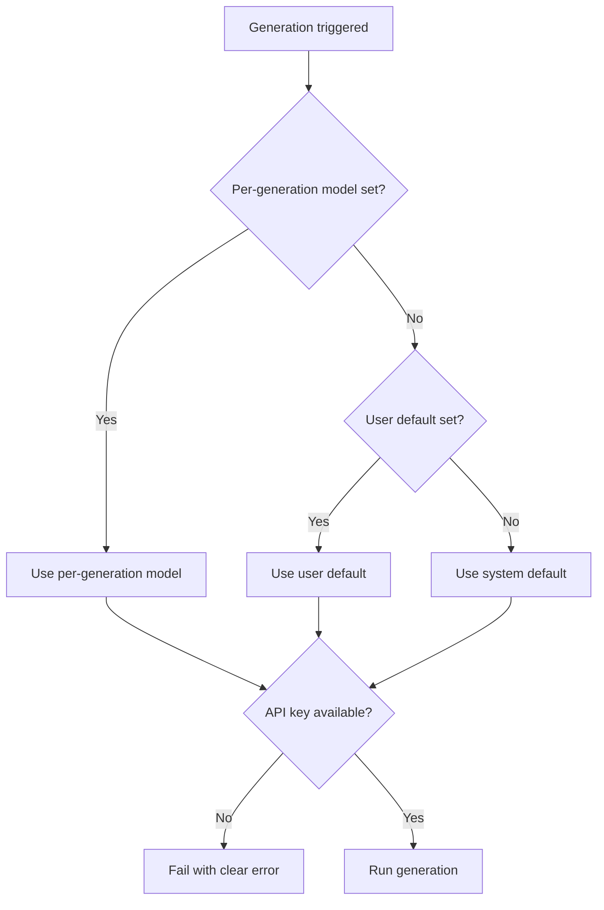

# Multi-Model Support — Technical Design

User-facing requirements: [`docs/user/multi-model-support.md`](../user/multi-model-support.md)

> This doc describes the **ideal state** of the system. It may not reflect the current implementation.

## Design goals

- Let users supply their own API keys for each provider (BYOK).
- Support model selection at three levels: system default, user default, per-generation override.
- A single `LLMPort` abstraction is the only interface agents talk to — no provider-specific code in agent logic.
- No provider is ever silently substituted; failure surfaces to the user.

## API key management

- Keys are stored per-user in the database, one field per provider.
- Keys are encrypted at rest; never returned to the client in plaintext.
- Validation happens at save time (a lightweight test call to the provider) and at generation time (surface provider error messages clearly).
- A demo/fallback key (used when no user key exists) is OpenAI-only. There is no Anthropic demo key.

## Model selection priority

```
per-generation override  →  user default  →  system default
```

The resolved provider and model are recorded on every generation run so they can be displayed in the UI.

## Selection flow



## Architecture

### LLM port and adapters

A single `LLMPort` interface defines all operations agents need (chat completion, streaming, etc.). Each provider has its own adapter implementing `LLMPort`. Agents never reference a provider directly — they receive an `LLMPort` instance at construction time.

### Models registry

A models registry lists every supported model and associates each with its provider. This lets the runtime route to the correct adapter without string parsing. The registry should be easy to update when new models are released.

### Agent construction

Agents accept a resolved `model` value at construction time. The caller (workflow orchestrator) resolves the model using the priority chain before constructing the agent.

### Settings UI

- A section per provider, each with an API key field.
- A default provider/model selector.
- API key input is a shared component pattern across providers.

### Generation form

An optional model override field. When left blank, the resolved default is used.

## Security

- API keys are never sent to the client. The settings page only shows a masked placeholder after saving.
- Key retrieval happens server-side only (API routes and workflow workers).
- API keys are never logged.

## Cost and token tracking

Each generation run should record:
- Provider
- Model
- Token counts (prompt + completion)

Providers return token usage in different shapes. Normalize to a common schema before persisting.

## Error handling

Provider error responses differ. Map them to a shared error type before surfacing to users:

| Condition | User message |
|---|---|
| Invalid API key | "Your [Provider] API key is invalid. Check your Settings." |
| Quota exceeded | "Your [Provider] usage limit has been reached." |
| Model not available | "The selected model is not available. Try a different model." |
| Network / unknown | "Something went wrong with [Provider]. Try again." |

## Out of scope

- Automatic provider fallback (if Anthropic fails, do not silently retry with OpenAI).
- Fine-tuned or self-hosted models.
- Organization-level model policies.
- Cost budgets or spend limits.
