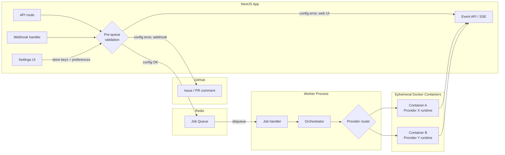
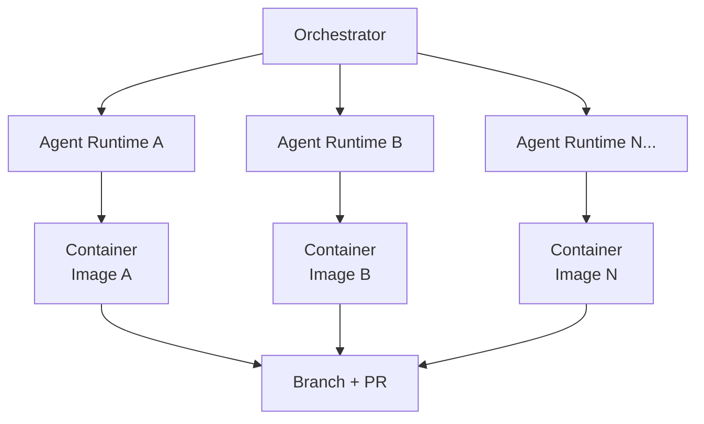
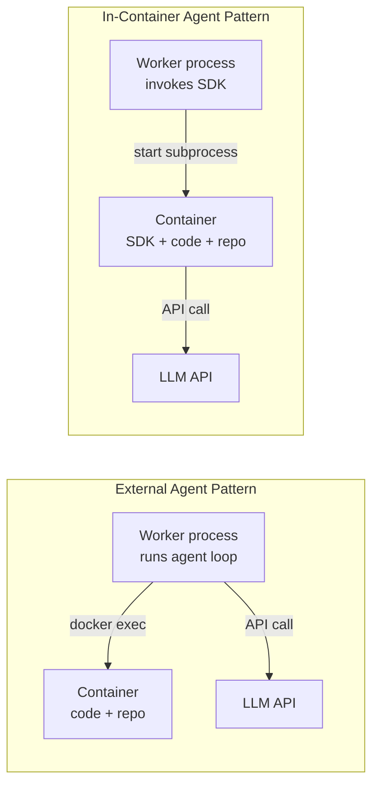

# Multi-Model Support — Technical Architecture

User-facing requirements: [`docs/user/multi-model-support.md`](../user/multi-model-support.md)

> This doc describes the **ideal architectural state** of the system. It may not reflect the current implementation.

## Design goals

- Let users supply their own API keys for each provider (BYOK).
- Support model selection at three levels: system default, user default, per-generation override.
- Each provider may use a fundamentally different agent runtime — the architecture accommodates this without forcing a single abstraction.
- No provider is ever silently substituted; failure surfaces to the user.
- Adding a new provider should not require changes to the orchestration or routing layers — only a new agent runtime and its configuration.

## API key management

See [`docs/dev/api-key-management.md`](api-key-management.md) for storage, validation, retrieval, and security details.

## Model selection and routing

### Selection priority

```text
per-generation override  →  user default  →  system default
```

The resolved provider and model are recorded on every workflow run so they can be displayed in the UI.

### Routing flow

Provider resolution happens in two stages: **pre-queue validation** and **runtime resolution**.

Pre-queue validation (in the API route or webhook handler) catches configuration errors that would definitely cause the job to fail — missing API keys, unsupported provider, no provider configured. If validation passes, the job is enqueued and the orchestrator handles runtime resolution: reading the provider preference and API key, selecting the agent runtime, and invoking it.

When pre-queue validation fails, the error goes back through the same channel the user came from:

| Stage | Purpose | Error feedback (web UI) | Error feedback (webhook) |
|---|---|---|---|
| **Pre-queue validation** | Reject jobs that will definitely fail (no key, unsupported provider) | Toast notification | GitHub issue/PR comment |
| **Runtime resolution** | Resolve provider + key, route to agent runtime | Workflow timeline | Workflow timeline |

### Where routing happens



**Pre-queue validation** catches errors that can be detected from settings alone — no need to start a workflow to know it will fail. The feedback goes back through the channel the user came from: toast for web UI, GitHub comment for webhooks.

**Runtime resolution** (worker/orchestrator) resolves the provider and retrieves the API key after dequeue. The orchestrator:

1. Reads the user's provider preference and API key from the database.
2. Selects the appropriate agent runtime.
3. Creates (or reuses) a Docker container configured for that runtime.
4. Invokes the agent.

The orchestrator's job is to resolve and retrieve — not to duplicate the pre-queue validation. If retrieval fails naturally (e.g., key was revoked between enqueue and dequeue), that surfaces as a runtime error in the workflow timeline.

## Agent runtime architecture

Different providers have fundamentally different SDKs and execution models. Rather than forcing them behind a single interface, each provider has its own **agent runtime** — the code that manages the LLM conversation loop, tool execution, and interaction with the container.



### What all runtimes share

Regardless of provider, every agent runtime:

- Receives the same inputs: issue details, repo environment, GitHub credentials.
- Produces the same outputs: code changes on a branch, optionally a pull request.
- Emits events to the same event schema (so the UI can display progress uniformly).
- Runs inside a Docker container with the repo cloned and a working branch checked out.
- Has access to GitHub operations (push branch, create PR) via custom tools or SDK configuration.

### How runtimes differ

The key architectural distinction is **where the agent logic runs** relative to the container:

| Aspect | External agent (e.g., OpenAI) | In-container agent (e.g., Claude Agent SDK) |
|---|---|---|
| **Agent process** | Runs in the worker; calls tools via `docker exec` | Runs inside the container as a subprocess |
| **Tool execution** | Worker invokes tools, which shell into the container | SDK invokes its own built-in tools on the local filesystem |
| **Docker image** | Generic base image (git, node, python, ripgrep) | Base image + SDK installed |
| **Conversation loop** | Managed by our code in the worker | Managed by the SDK internally |
| **Custom tools** | Defined as functions in our codebase | Provided to the SDK as MCP tools or tool definitions |



Provider-specific details are documented separately:

- [`docs/dev/openai-models.md`](openai-models.md) — OpenAI agent runtime
- [`docs/dev/claude-models.md`](claude-models.md) — Claude Agent SDK runtime

## Event tracking

Both runtimes emit events to the same Neo4j event chain and Redis streams so the UI can display workflow progress uniformly. Each runtime needs an adapter to map its native output format to our event schema:

- LLM responses → `llmResponse` events
- Tool invocations → `toolCall` / `toolCallResult` events
- Workflow lifecycle → `workflowStarted` / `workflowCompleted` events
- Provider and model recorded on the workflow run node

## Cost and token tracking

Each workflow run records:

- Provider
- Model
- Token counts (prompt + completion)

Providers return token usage in different shapes. Each runtime normalizes usage to a common schema before persisting.

## Error handling

Provider error responses differ. Each runtime maps errors to a shared error type before surfacing to users:

| Condition | User message |
|---|---|
| Invalid API key | "Your [Provider] API key is invalid. Check your Settings." |
| Quota exceeded | "Your [Provider] usage limit has been reached." |
| Insufficient funds | "Your [Provider] account has insufficient funds. Add credits and try again." |
| Model not available | "The selected model is not available. Try a different model." |
| Any other error | "Something went wrong with [Provider]. Please try again." |

## Out of scope

- Automatic provider fallback (if one provider fails, do not silently retry with another).
- Fine-tuned or self-hosted models.
- Organization-level model policies.
- Cost budgets or spend limits.
