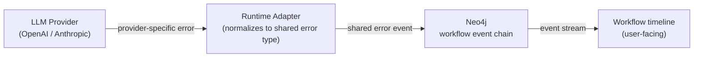

# Observability — Technical Architecture

Related docs: [`docs/dev/multi-model-support.md`](multi-model-support.md) · [`docs/dev/openai-models.md`](openai-models.md) · [`docs/dev/claude-models.md`](claude-models.md)

> This doc describes the **ideal architectural state** of the system. It may not reflect the current implementation.

## What we track

Every workflow run records the following on its Neo4j run node:

- Provider (openai, anthropic)
- Model name
- Token counts — prompt tokens, completion tokens, total tokens
- Total cost in USD
- Run duration
- Number of agent loop turns

Data is tagged by provider so cross-provider comparisons are meaningful.

## How each runtime reports usage

### OpenAI runtime

Token usage comes from the Responses API response on each turn. The agent loop already captures and emits these per-turn as events. Usage is accumulated across turns and written to the workflow run node on completion.

See [`docs/dev/openai-models.md`](openai-models.md) for the agent loop details.

### Claude Agent SDK runtime

The SDK's `ResultMessage` (returned at the end of a `query()` call) includes:

- `total_cost_usd` — total cost for the run
- `usage` — prompt and completion token counts
- `num_turns` — number of agent loop turns
- `session_id` — for session resumption

The result subtype also indicates how the run ended: `success`, `error_max_turns`, `error_max_budget_usd`, or `error_during_execution`. This is persisted alongside the usage data.

See [`docs/dev/claude-models.md`](claude-models.md) for the SDK invocation details.

### Normalization

Each runtime normalizes its provider-native usage format to a common schema before writing to Neo4j. Neither the orchestrator nor the UI is aware of provider-specific usage shapes.

## Langfuse integration

Langfuse provides LLM-level observability: traces, token usage, cost analysis, and latency across providers.

- Each workflow run maps to a Langfuse trace
- Individual LLM calls within the run are recorded as spans
- Langfuse dashboards allow cross-provider cost and performance comparison
- Token and cost data recorded in Langfuse mirrors what is stored in Neo4j — both sources should agree

Langfuse is a complement to Neo4j storage, not a replacement. Neo4j is the operational data store; Langfuse is the analytics layer.

## Error propagation

Provider errors are caught by the runtime adapter and written to the Neo4j workflow event chain. The UI reads these events and displays them in the workflow run timeline.

Error conditions and the corresponding user messages are defined in [`docs/dev/multi-model-support.md`](multi-model-support.md#error-handling):

| Condition | Examples |
|---|---|
| Invalid API key | Key rejected by the provider |
| Quota exceeded | Rate limit or monthly cap reached |
| Insufficient funds | Account balance too low |
| Model not available | Model deprecated or region-restricted |
| Timeout | Provider did not respond in time |
| General error | Any other provider error |

Each runtime maps its provider-specific error responses to one of these categories before emitting the event. No provider-specific error details reach the UI layer directly.

## Runtime monitoring

The following are captured per run and are available for querying in Neo4j and Langfuse:

| Metric | Source |
|---|---|
| Run duration | Recorded from workflow start to completion event |
| Number of turns | Reported by SDK (`num_turns`) or counted by our loop |
| Token usage per turn | Emitted as events by the agent loop |
| Total cost | Aggregated from per-turn usage or SDK `total_cost_usd` |

There are no hard limits enforced today — the priority is full visibility.

## Future: configurable limits

The Claude Agent SDK supports `maxTurns` and `maxBudgetUsd` options natively. When limits are introduced, these will be set per workflow run and enforced by the SDK for Claude, and by our agent loop for OpenAI.

Planned limit types:

- Max agent loop turns
- Max cost per run (USD)
- Max run duration

When a limit is hit, the runtime emits a structured event (not a generic error) so the UI can display the specific reason the run stopped.
