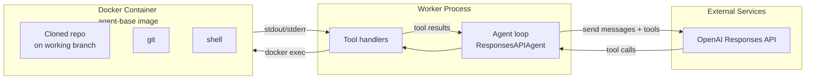

# OpenAI Agent Runtime

Parent doc: [`docs/dev/multi-model-support.md`](multi-model-support.md)

> This doc describes how OpenAI models operate within the issue-to-pr infrastructure.

## Runtime pattern: External agent

The OpenAI agent follows the **external agent pattern** — the agent loop runs in the worker process, and tool calls are executed against the container via `docker exec`.

## How it works

1. **Worker creates container** from the generic `agent-base` image (git, node, python, ripgrep). The repo is cloned and a working branch is checked out.

2. **Worker instantiates the agent** in-process. The agent holds a reference to the container name and the user's OpenAI API key.

3. **Agent runs conversation loop**: sends messages to the OpenAI Responses API, receives tool call requests, executes them, and feeds results back. This loop is managed by our code.

4. **Tool execution**: Each tool is a function in our codebase. File operations, git commands, and shell commands are executed inside the container via Docker's exec API (Dockerode). GitHub API operations (push, create PR) are executed directly from the worker process using the GitHub installation token.

5. **Events**: The agent emits events to Neo4j and Redis as it processes each turn — system prompts, LLM responses, tool calls, tool results, reasoning steps.

## Custom tools

All tools are defined and managed in our codebase:

| Tool | What it does | Execution |
|---|---|---|
| `get_file_content` | Read file contents | docker exec: cat |
| `write_file` | Create/modify files | docker exec: write |
| `ripgrep_search` | Full-text code search | docker exec: rg |
| `setup_repo` | Install dependencies | docker exec: npm/pip/etc. |
| `manage_branch` | Create/checkout branches | docker exec: git |
| `commit_changes` | Stage and commit | docker exec: git |
| `file_check` | Run linting/type-checking | docker exec: eslint/tsc/etc. |
| `container_exec` | Arbitrary shell command | docker exec |
| `sync_branch_to_remote` | Push branch to GitHub | GitHub API (from worker) |
| `create_pull_request` | Open PR, link issue, label | GitHub API (from worker) |
| `web_search` | Search the web | OpenAI built-in tool |

## Docker image

Uses the generic `agent-base` image — no OpenAI-specific dependencies needed in the container since the agent runs in the worker process.

## API key injection

The user's OpenAI API key is passed directly to the OpenAI SDK client in the worker process. It never enters the container environment.
