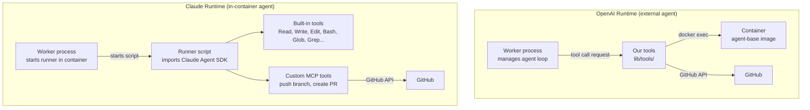
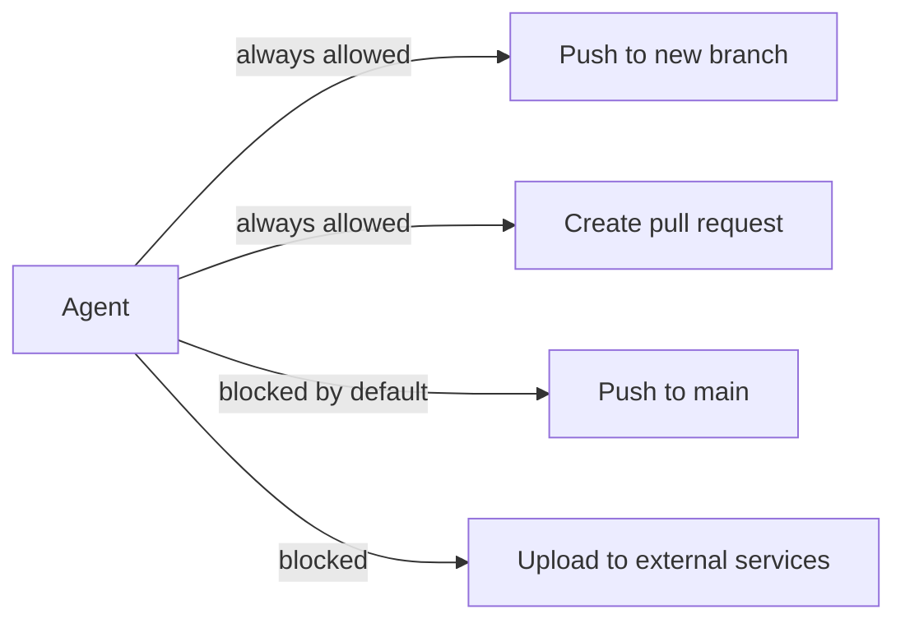

# Tool and Permission Architecture

Parent doc: [`docs/dev/multi-model-support.md`](multi-model-support.md)

User-facing doc: [`docs/user/tools.md`](../user/tools.md)

> This doc describes the **ideal architectural state** of the system. It may not reflect the current implementation.

## Overview

The two agent runtimes have fundamentally different tool models. The OpenAI runtime owns the full tool layer — every capability is a function in our codebase. The Claude runtime delegates most tool execution to the SDK — we only add what the SDK cannot do natively.

Both runtimes produce the same outputs: code changes on a branch, an optional pull request, and events emitted to Neo4j.

## Tool model by runtime

## Tool inventory

### OpenAI runtime — all tools are custom

| Tool | Purpose | Execution target |
|---|---|---|
| `get_file_content` | Read file contents | docker exec |
| `write_file` | Create or modify files | docker exec |
| `ripgrep_search` | Full-text code search | docker exec |
| `setup_repo` | Install project dependencies | docker exec |
| `manage_branch` | Create and checkout branches | docker exec |
| `commit_changes` | Stage and commit changes | docker exec |
| `file_check` | Run linting and type-checking | docker exec |
| `container_exec` | Arbitrary shell command | docker exec |
| `sync_branch_to_remote` | Push branch to GitHub | GitHub API (from worker) |
| `create_pull_request` | Open PR, link issue, apply labels | GitHub API (from worker) |
| `web_search` | Search the web | OpenAI built-in |

### Claude runtime — mostly built-in, two custom

The SDK provides file I/O, git, shell, search, and web access natively. We only supply tools for GitHub operations that require our authentication credentials.

| Tool | Source | Purpose |
|---|---|---|
| Read, Write, Edit | SDK built-in | File operations |
| Bash | SDK built-in | Shell commands, git |
| Glob, Grep | SDK built-in | Code navigation and search |
| WebSearch, WebFetch | SDK built-in | Web access |
| `sync_branch_to_remote` | Custom (MCP) | Push branch to GitHub |
| `create_pull_request` | Custom (MCP) | Open PR, link issue, apply labels |

## How custom tools are provided to the Claude SDK

The SDK does not accept arbitrary functions directly. Custom tools are exposed via an MCP server created with `createSdkMcpServer()` and passed to the SDK at startup alongside the prompt and system instructions. The SDK treats these tools the same as its built-in capabilities.

## Permission model

### Inside the container — unrestricted

The container is a disposable sandbox with no persistent state. The agent has full access to:

- Read, write, and delete any file in the repo
- Run arbitrary shell commands
- Install packages
- Modify git history

This is intentional. Restricting the agent inside the sandbox adds friction without reducing risk — if an agent deletes the repo directory, the container is discarded and a fresh one is used.

For the Claude runtime, this is enforced via `bypassPermissions: true` for all file and shell operations. The SDK's normal confirmation prompts are suppressed inside the container.

### External actions — controlled

Actions with real-world consequences are restricted regardless of runtime:

| Operation | Default policy | Rationale |
|---|---|---|
| Push to a new branch | Allowed | Low risk; branches are easy to delete |
| Create a pull request | Allowed | Follows PR conventions; links issue |
| Push directly to `main` | Blocked | Irreversible without force push or revert |
| Push to `main` (user opt-in) | Configurable | User assumes responsibility |
| Upload to external services | Blocked | Not in scope unless explicitly authorized |

The `main` branch guard is applied in the `sync_branch_to_remote` tool in both runtimes. It checks the target branch name before executing the push and rejects the operation if it matches the repository's default branch, unless the user has explicitly enabled direct-to-main pushes in their settings.

Pull request creation follows these conventions:

- Links the originating GitHub issue
- Applies relevant labels if configured
- Does not auto-merge

## Tool call event tracking

Both runtimes map tool activity to the shared event schema before writing to Neo4j. The relevant event types are:

| Event | Emitted when |
|---|---|
| `toolCall` | Agent invokes a tool (includes tool name and input) |
| `toolCallResult` | Tool returns a result (includes output or error) |

For the OpenAI runtime, the worker emits these events directly as it processes each conversation turn. For the Claude runtime, the worker extracts them from the structured output streamed by the runner script inside the container.

Neither runtime persists raw tool output to Neo4j — only the structured event records.

See [`docs/dev/multi-model-support.md`](multi-model-support.md#event-tracking) for the full event schema context.
