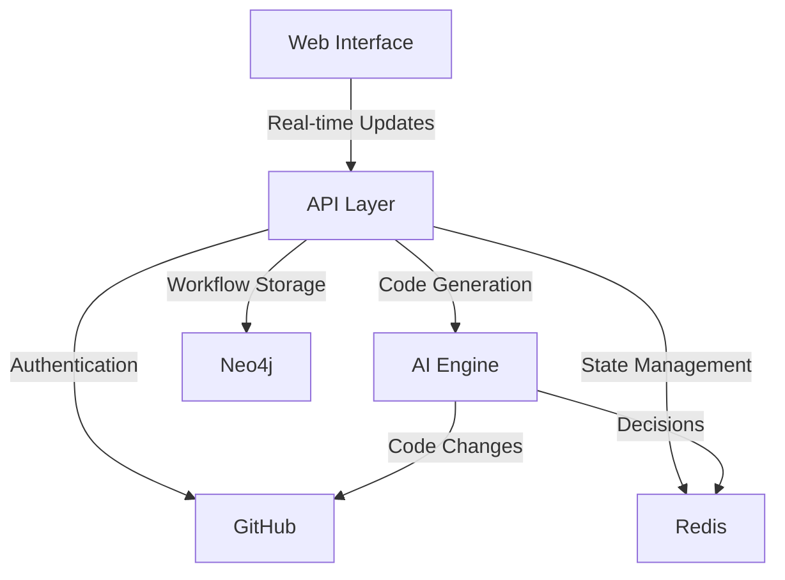

# System Architecture Overview

## Table of Contents

1. [System Overview](#system-overview)
2. [Technology Stack](#technology-stack)
3. [Component Interactions](#component-interactions)
4. [Detailed Documentation](#detailed-documentation)

## System Overview

Our system is a GitHub-integrated workflow automation platform that converts issues into pull requests using AI assistance. The system consists of four main components:

1. **Web Interface**: A Next.js application providing real-time workflow visualization and control
2. **API Layer**: Handles GitHub integration and coordinates workflow processes
3. **AI Engine**: Manages multiple specialized AI agents for code generation and decision making
4. **Data Storage**: Dual database system for different data requirements

## Technology Stack

### Frontend Technologies

- Next.js 14 (App Router)
- TailwindCSS + Shadcn/ui
- Real-time updates via SSE

### Backend Technologies

- Next.js API routes
- GitHub API integration
- OpenAI API
- Redis
- Neo4j

### Authentication

- NextAuth.js
- GitHub OAuth & App integration

## Component Interactions

## Detailed Documentation

### Core Components

- [Authentication System](authentication.md)
- [AI Integration Details](ai-integration.md)
- [API Documentation](../api/README.md)

### Data Architecture

- [Database Architecture](guides/databases/neo4j-architecture.md)
- [Redis Architecture](guides/databases/redis-architecture.md)
- [Data Flow Patterns](guides/databases/data-flow.md)

### Development

- [Implementation Stages](../setup/implementation-stages.md)
- [Getting Started Guide](../setup/getting-started.md)
- [Contributing Guide](contributing.md)

### User Documentation

- [Workflow Visualization](user-stories/workflow-visualization.md)
