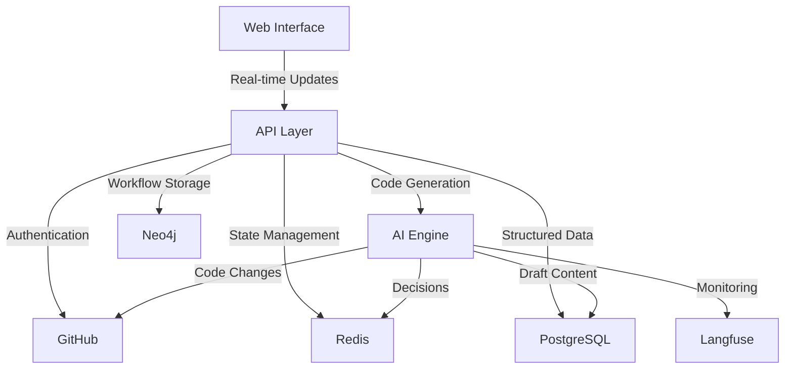

# System Architecture Overview

## Table of Contents

1. [System Overview](#system-overview)
2. [Technology Stack](#technology-stack)
3. [Component Interactions](#component-interactions)
4. [Observability](#observability)
5. [Detailed Documentation](#detailed-documentation)

## System Overview

Our system is a GitHub-integrated workflow automation platform that converts issues into pull requests using AI assistance. The system consists of four main components:

1. **Web Interface**: A Next.js application providing real-time workflow visualization and control
2. **API Layer**: Handles GitHub integration and coordinates workflow processes
3. **AI Engine**: Manages multiple specialized AI agents for code generation and decision making
4. **Data Storage**: Multi-database system optimized for different data requirements:
   - PostgreSQL for structured data and draft content
   - Neo4j for workflow relationships
   - Redis for real-time state management

## Technology Stack

### Frontend Technologies

- Next.js 14 (App Router)
- TailwindCSS + Shadcn/ui
- Real-time updates via SSE

### Backend Technologies

- Next.js API routes
- GitHub API integration
- OpenAI API
- PostgreSQL
- Redis
- Neo4j
- Langfuse (AI Observability)

### Authentication

- NextAuth.js
- GitHub OAuth & App integration

### Observability

- Langfuse for AI operation monitoring
- Performance metrics tracking
- Cost and usage analytics

## Component Interactions

### Component Descriptions

#### Web Interface

- **Purpose**: Provides real-time workflow visualization and control interface
- **Key Features**:
  - Real-time status updates via Server-Sent Events (SSE)
  - Interactive workflow controls
  - User authentication and authorization
  - Dashboard for monitoring and analytics

#### API Layer

- **Purpose**: Central coordination point for all system operations
- **Responsibilities**:
  - GitHub API integration management
  - Authentication and session handling
  - Workflow state coordination
  - Real-time event broadcasting
  - Database operations orchestration

#### GitHub Integration

- **Purpose**: Handles all interactions with GitHub's platform
- **Operations**:
  - OAuth authentication
  - Issue and PR management
  - Code repository operations
  - Webhook event processing
  - Comment and review management

#### AI Engine

- **Purpose**: Manages AI-driven code generation and decision making
- **Capabilities**:
  - Code analysis and generation
  - PR creation and updates
  - Technical decision making
  - Code review suggestions
  - Documentation generation

#### Redis (State Management)

- **Purpose**: Handles real-time state and caching
- **Usage**:
  - Workflow state caching
  - Real-time event queuing
  - Session management
  - Rate limiting
  - Temporary data storage

#### Neo4j (Workflow Storage)

- **Purpose**: Persistent storage for workflow data and relationships
- **Data Stored**:
  - Workflow histories
  - Relationship mappings
  - Long-term analytics data
  - User preferences and settings
  - System configuration

#### PostgreSQL (Structured Data)

- **Purpose**: Stores structured data and draft content
- **Data Stored**:
  - Structured data
  - Draft content
  - User preferences and settings
  - System configuration

#### Langfuse (Observability)

- **Purpose**: Monitors and analyzes AI operations
- **Features**:
  - Performance tracking
  - Cost monitoring
  - Usage analytics
  - Error tracking
  - Optimization insights

### Key Interaction Patterns

1. **Real-time Updates Flow**

   - User action triggers event in Web Interface
   - API Layer processes event and updates state in Redis
   - Changes are propagated to relevant components
   - Web Interface receives updates via SSE

2. **Code Generation Flow**

   - API Layer receives request for code generation
   - AI Engine analyzes requirements
   - Generated code is submitted to GitHub
   - Status updates are stored in Redis
   - Long-term data is persisted to Neo4j

3. **Content Review Flow**

   - User initiates workflow in Web Interface
   - AI Engine generates content
   - Draft content stored in PostgreSQL
   - User reviews content in Web Interface
   - Upon approval, content is published to GitHub
   - Status updates stored in Neo4j
   - Real-time updates via Redis

4. **Monitoring Flow**
   - AI operations are tracked by Langfuse
   - Performance metrics are collected
   - Analytics are made available via dashboard
   - Optimization suggestions are generated

## Observability

The system uses Langfuse for comprehensive AI operation monitoring:

1. **Performance Tracking**

   - Latency monitoring
   - Token usage metrics
   - Success/failure rates

2. **Cost Management**
   - Usage analytics
   - Cost allocation
   - Optimization insights

For detailed information, see our [Observability Guide](observability.md)

## Detailed Documentation

### Core Components

- [Authentication System](authentication.md)
- [AI Integration Details](ai-integration.md)
- [API Documentation](../api/README.md)
- [Observability Guide](observability.md)

### Data Architecture

- [Database Architecture](guides/databases/neo4j-architecture.md)
- [Redis Architecture](guides/databases/redis-architecture.md)
- [Data Flow Patterns](guides/databases/data-flow.md)

### Development

- [Getting Started Guide](../setup/getting-started.md)
- [Contributing Guide](contributing.md)

### User Documentation

- [Workflow Visualization](user-stories/workflow-visualization.md)
