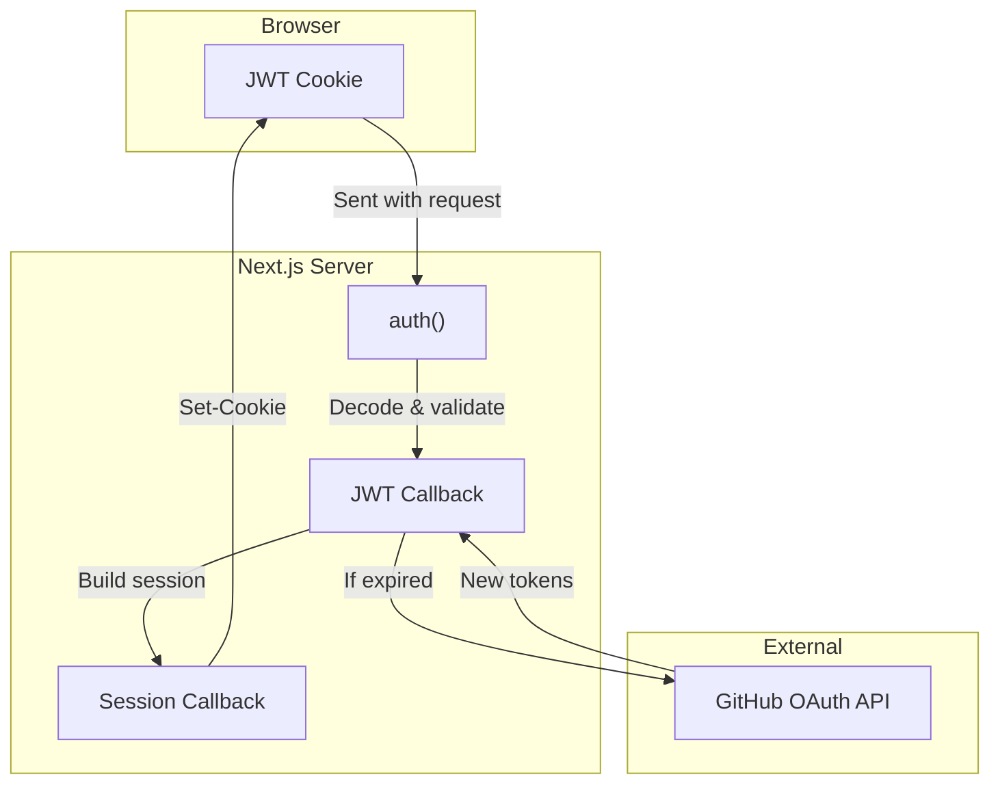
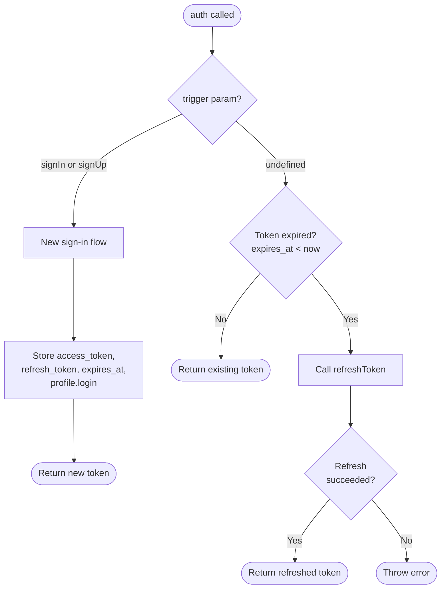
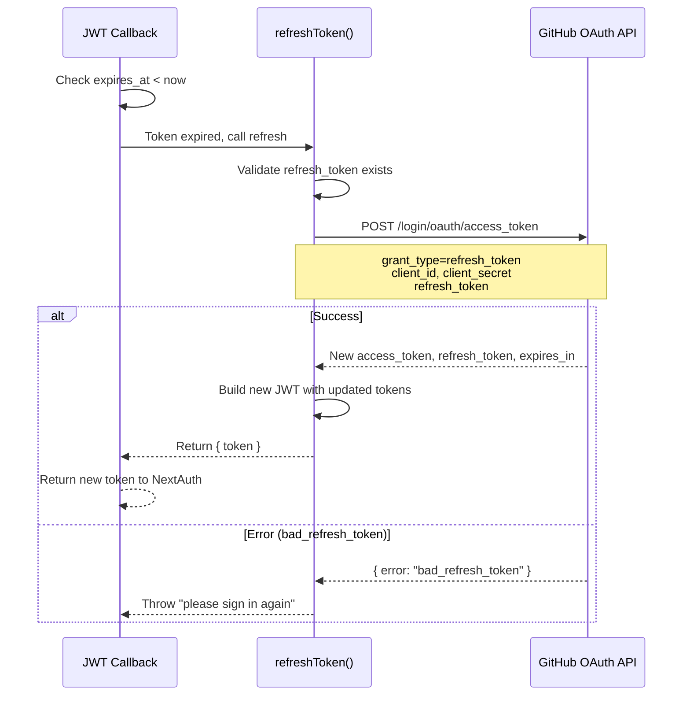
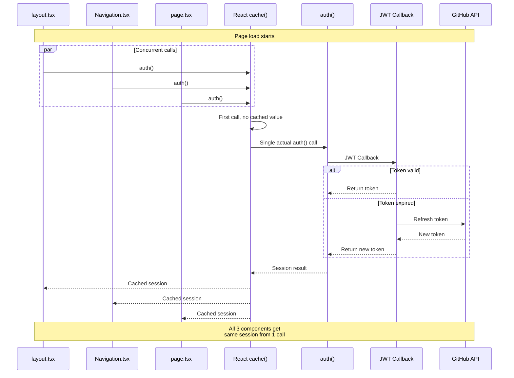
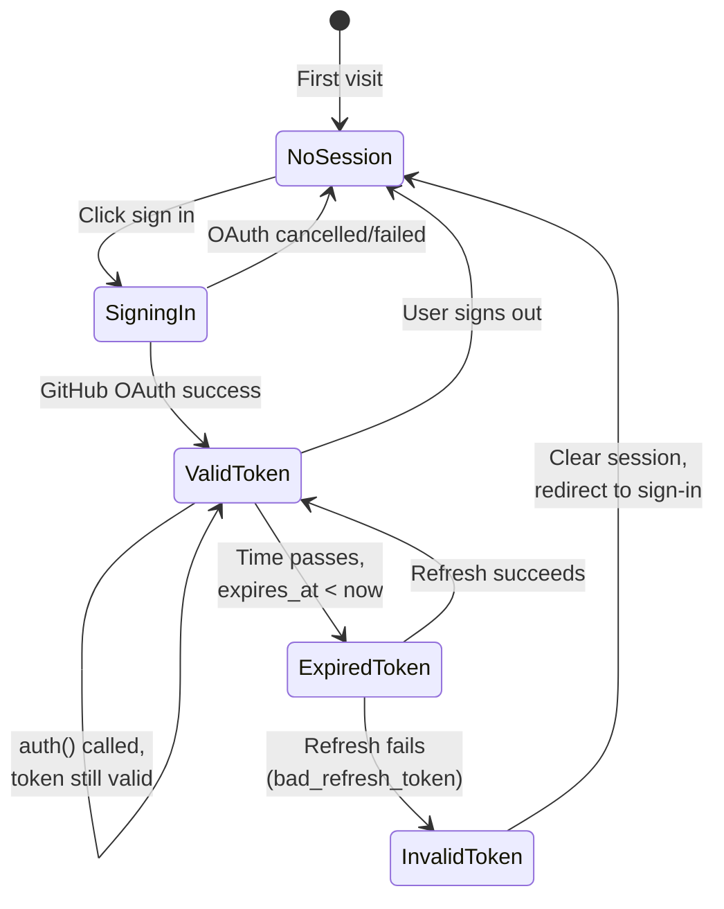
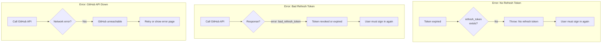

# Auth Flow Technical Documentation

This document explains how authentication works in the application with visual diagrams.

## File Structure

```text
auth.ts                          # NextAuth config, JWT callback logic
lib/auth/
  cached-auth.ts                 # React cache() wrapper for request deduplication
  config.ts                      # Auth configuration constants
  refresh-token.ts               # GitHub token refresh (HTTP only)
```

## High-Level Overview



## JWT Callback Decision Tree

This is the core auth logic in `auth.ts`. Every `auth()` call triggers this callback.



## Token Refresh Flow

When a token expires, `lib/auth/refresh-token.ts` handles the refresh.



## Page Load with React cache()

Multiple components call `auth()` during a single page render. React `cache()` deduplicates these calls.



## Token States and Transitions



## Error Scenarios



## Key Design Decisions

1. **No Redis for auth** - Simplifies deployment, works on Edge runtime
2. **React cache() for deduplication** - Multiple auth() calls in one request share result
3. **HTTP-only refresh** - Uses fetch(), works on Edge (no TCP sockets needed)
4. **JWT in cookie** - Stateless server, no session storage needed
5. **trigger param** - Uses AuthJS's `trigger` param ("signIn"/"signUp") to detect initial sign-in vs session check
