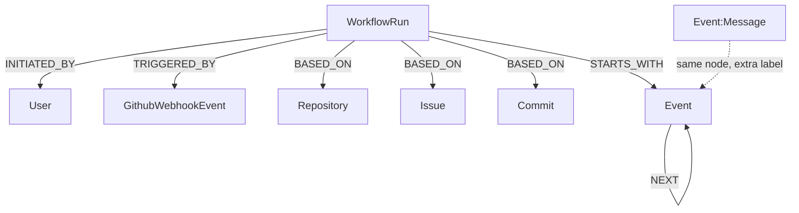

# Workflow Runs in Neo4j (Current State)

**As of:** 2026-01-21 12:00 UTC+8
**Commit:** 037fae675b3f2108e74eff40ab173a0ccb7e72f0

This documents the current state of how workflow runs are stored in Neo4j.

## Graph Structure


classDef parallel fill:#fff9c4,stroke:#f57f17,stroke-width:2px

- Event chains now support fan-out. Multiple `:NEXT` relationships may originate from the same parent event to represent parallel tool calls.
- When adding an event, you can supply a `parentEventId` to attach the new event as a child of a specific parent rather than appending to the tail.

## Node Labels

| Label | Purpose |
| ------- | --------- |
| `WorkflowRun` | A single execution of a workflow |
| `Event` | Base label for all events in a workflow |
| `Message` | Additional label for LLM conversation events |
| `Plan` | Additional label for plan events |
| `User` | The user who initiated the workflow |
| `GithubWebhookEvent` | Webhook that triggered an automated workflow |
| `Issue` | GitHub issue the workflow operates on |
| `Repository` | GitHub repository context |

## Event Types (Neo4j Storage)

Events are stored with **camelCase** type names.

### Message Events

Events with both `:Event` and `:Message` labels:

| type | Description |
| ------ | ------------- |
| `systemPrompt` | Initial system instructions |
| `userMessage` | User input to the LLM |
| `llmResponse` | LLM response text |
| `toolCall` | LLM requesting a tool execution |
| `toolCallResult` | Result from a tool execution |
| `reasoning` | LLM reasoning/thinking |

### Workflow Events

Events with only `:Event` label:

| type | Description |
| ------- | ------------- |
| `status` | Status update message |
| `error` | Error that occurred |
| `workflowState` | State transition (pending, running, completed, error, timedOut) |
| `workflowStarted` | Workflow execution began |
| `workflowCompleted` | Workflow finished successfully |
| `workflowCancelled` | Workflow was cancelled |
| `workflowCheckpointSaved` | Checkpoint was saved |
| `workflowCheckpointRestored` | Checkpoint was restored |

### Plan Events

Events with `:Event`, `:Message`, and `:Plan` labels have additional properties: `status`, `version`, `editMessage`.

## Multi-Label Pattern

A single node can have multiple labels:

- `[:Event, :Message]` - Conversation events
- `[:Event, :Message, :Plan]` - Plan events

## Event Chain

Events form a linked structure via `NEXT` relationships. With the new fan-out support, an event may have 0..N `NEXT` edges.

```cypher
// Append sequentially (legacy behavior)
CALL {
  WITH $workflowRunId AS runId, $eventId AS id
  // create event node then append using last event discovery
}

// Attach as a parallel child of a known parent
MATCH (parent:Event {id: $parentEventId})
MATCH (child:Event {id: $eventId})
MERGE (parent)-[:NEXT]->(child)
```

Storage helper changes:
- `addEvent` query now accepts an optional `parentEventId`.
- The StorageAdapter's `WorkflowEventInput` includes an optional `parentId` to leverage the fan-out model.

### Convergence (joins) of parallel branches

- We do not yet model an explicit N→1 "join" edge. The recommended pattern for now is:
  - Create a subsequent event (e.g., an LLM turn) that selects one of the parallel children as its parent via `NEXT`.
  - Optionally include references (ids) to sibling tool call/results in the event payload to make the join semantics explicit to readers.
  - Queries that list events in time-order still return a coherent timeline; sibling events that occurred around the same timestamp appear grouped together.
- Future enhancement: introduce an explicit join event or allow attaching multiple parents to a single child when we add an "attach existing event" operation.

## Naming Conventions

The codebase currently has two naming conventions for different layers:

| Layer | Convention | Example |
| --- | --- | --- |
| **Neo4j Storage** | camelCase | `workflowStarted`, `toolCall` |
| **Application Events** | dot-notation | `workflow.started`, `tool.call` |

Mappers in `shared/src/adapters/neo4j/queries/workflowRuns/` handle conversion between these formats.

## WorkflowRun Properties

| Property | Type | Required |
| ---------- | ------ | ---------- |
| `id` | string | Yes |
| `type` | enum | Yes |
| `createdAt` | DateTime | Yes |
| `state` | enum | No |
| `postToGithub` | boolean | No |

## Ideal data model (forward-looking)

This forward-looking diagram shows the desired simplification of relationships and label usage while retaining fan-out support.



Notes:
- Use generic relationship names like `BASED_ON` to keep queries flexible; the end node type conveys the detail.
- Keep the multi-label pattern `:Event:Message` so a single event stream remains queryable via `[:STARTS_WITH|NEXT*]`.

## Key Files

- **Schema definitions:** `shared/src/adapters/neo4j/types.ts`
- **DB-layer types:** `shared/src/lib/types/db/neo4j.ts`
- **Event mappers:** `shared/src/adapters/neo4j/queries/workflowRuns/*.mapper.ts`
- **Type conversion:** `shared/src/lib/neo4j/convert.ts`

