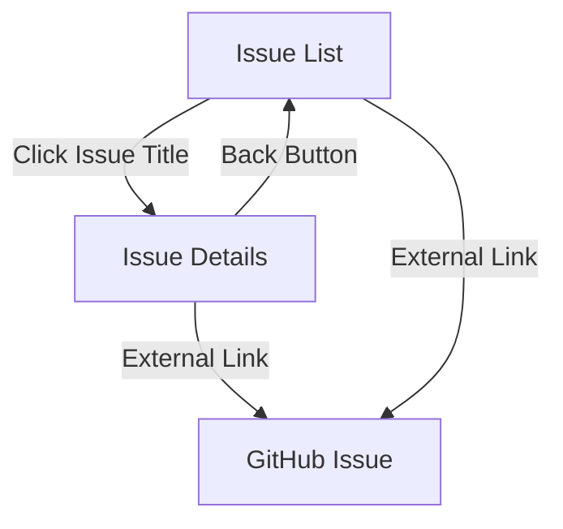
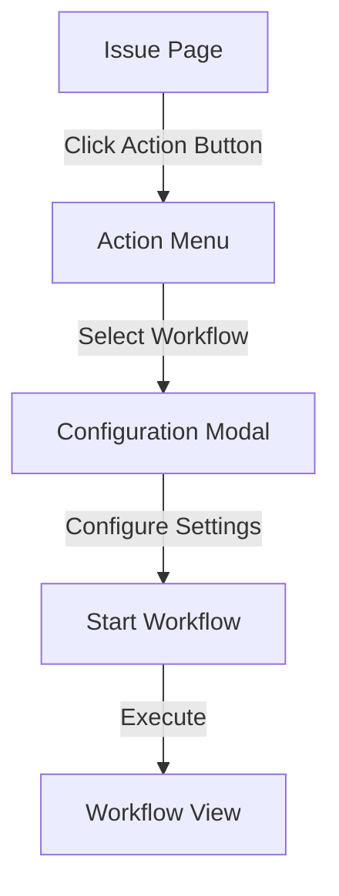
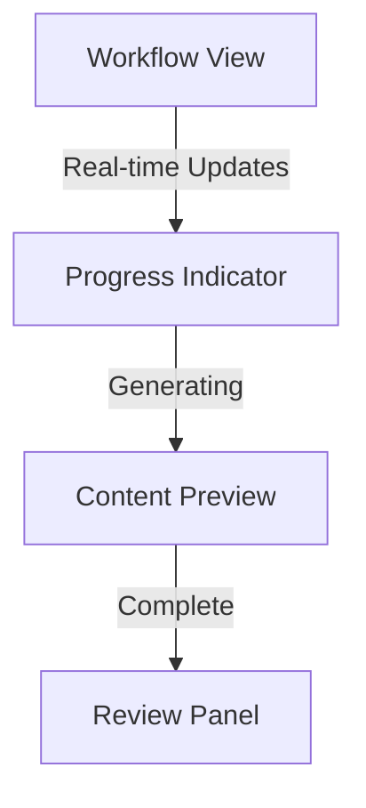
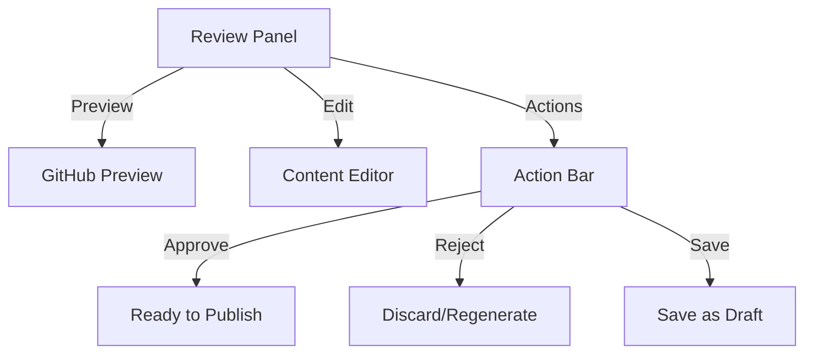
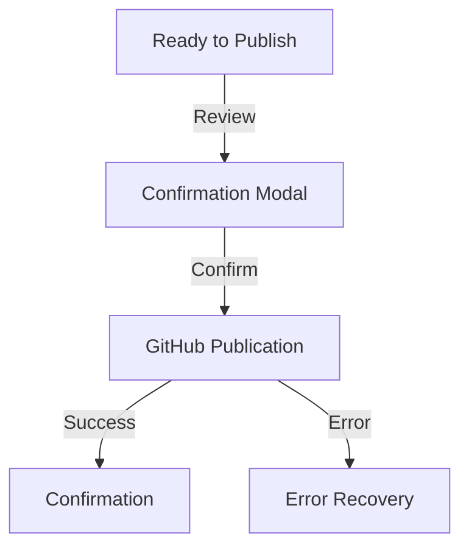
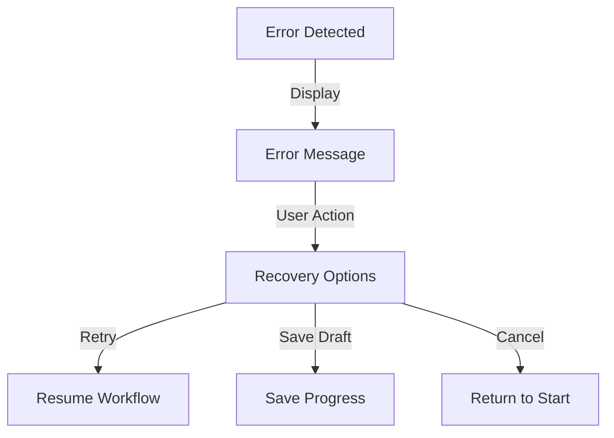

# UI/UX Flow: Workflow Execution and Content Review

## Overview

This document describes the ideal user interface flow for executing workflows and reviewing content before publication to GitHub. The focus is on providing clear control over GitHub interactions while maintaining a smooth user experience.

## Navigation Patterns

### Issue List to Details Flow

- **Issue List Navigation**:

  - Issue titles use client-side navigation
  - External GitHub links open in new tabs
  - Clear visual distinction between internal/external links

- **Issue Details Navigation**:
  - Back button returns to issue list
  - Consistent button styling with design system
  - Clear visual hierarchy
  - Smooth transitions between states

## Global Controls

### User Preferences

- **Location**: User settings menu
- **Default Settings**:
  - Auto-publish comments: Off
  - Auto-publish PRs: Off
  - Save drafts: On

## Workflow Execution Flow

### 1. Workflow Initiation

- **Entry Point**: GitHub issue page
- **Action Button**:
  - Located near issue title
  - Shows available workflows
- **Configuration Modal**:
  - Workflow-specific settings
  - Override default preferences

### 2. Workflow Progress View

- **Progress Display**:
  - Step-by-step progress
  - Current action indicator
  - Estimated time remaining
- **Content Generation**:
  - Live preview of generated content
  - Intermediate results shown
  - Cancel option available

### 3. Content Review Interface

- **Preview Section**:
  - Side-by-side with original issue
  - GitHub markdown preview
  - Diff view for changes
- **Edit Controls**:
  - Rich text editor
  - Markdown support
  - Format validation
- **Action Bar**:
  - Clear action buttons
  - Save draft option
  - Publish controls

### 4. Publication Flow

- **Pre-publication Review**:
  - Final content preview
  - Action summary
  - Clear indicators for GitHub impact
- **Publication Controls**:
  - Explicit publish button
  - Confirmation required

## Draft Management

### Draft Content Dashboard

- **Location**: Dedicated dashboard view
- **Features**:
  - List of all drafts
  - Status indicators
  - Bulk actions
  - Search and filter
- **Actions**:
  - Edit drafts
  - Delete drafts
  - Publish drafts
  - Archive drafts

## Status Indicators

### Visual Cues

- **Publication Status**:
  - Draft: Gray
  - Ready to Publish: Blue
  - Published: Green
  - Error: Red

### Tooltips and Help

- Hover explanations
- Context-sensitive help
- Clear action descriptions
- Error resolution guidance

## Error Handling

### User Feedback

- Clear error messages
- Recovery options
- Auto-save protection
- Retry capabilities

### Recovery Flow

## Implementation Notes

1. **Progressive Enhancement**:

   - Basic functionality without JS
   - Enhanced features with JS
   - Fallback behaviors defined

2. **State Management**:

   - Clear state indicators
   - Persistent draft storage
   - Session recovery

3. **Performance Considerations**:

   - Immediate UI feedback
   - Background processing
   - Optimistic updates

4. **Accessibility**:
   - Keyboard navigation
   - Screen reader support
   - ARIA labels
   - Focus management
