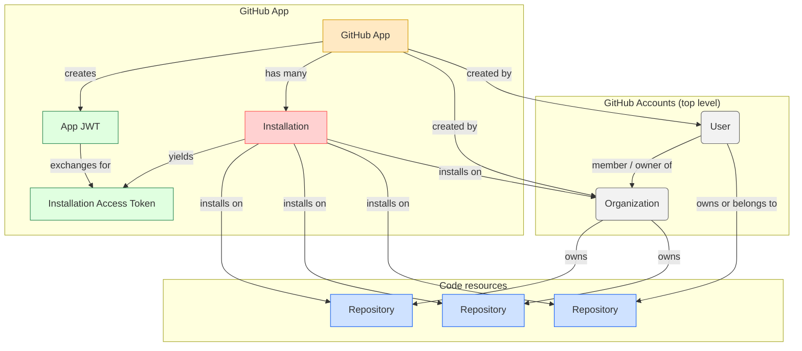

Below is a “mental-model cheat-sheet” that you can keep next to your code editor.  
It contains (1) one-screen mermaid diagram, (2) a compact table that describes every node and edge, and (3) the key GitHub docs you can consult for any box in the chart.

Copy the diagram into any Markdown viewer that supports mermaid (e.g., GitHub, VS Code’s Markdown Preview) and it will render as an interactive SVG.

Legend  
| Color | Entity | Quick description |
|---|---|---|
| Gray | Account (User / Org) | Top-level identity in GitHub |
| Light-blue | Repository | Code plus issues, PRs, etc. |
| Yellow | GitHub App | First-class OAuth-enabled integration |
| Pink | Installation | “Copy” of the app attached to an owner (org/user) and optional repo filter |
| Green | Token (JWT / IAT) | Credentials—how the app authenticates |

---

1-page reference table

| Term                      | Parent          | Children / Outputs                 | What it’s for                                                               |
| ------------------------- | --------------- | ---------------------------------- | --------------------------------------------------------------------------- |
| User                      | —               | Repos, Gists, Personal PATs        | Human individual                                                            |
| Organization              | —               | Repos, Teams, Members, GitHub Apps | Group of users                                                              |
| Repository                | User **or** Org | Branches, Issues, PRs              | Code unit                                                                   |
| GitHub App                | User **or** Org | Installations, Webhooks            | Integration you register                                                    |
| Installation              | GitHub App      | Installation Access Tokens         | Concrete deployment of the app on 1 owner (user/org) and zero-or-more repos |
| App JWT                   | GitHub App      | — (expires in 10 min)              | Auth as **the app itself** (scope: metadata)                                |
| Installation Access Token | Installation    | — (expires ≤ 1 h)                  | Auth as **that installation** (scope: repos granted)                        |

---

Typical API flows

| You want to…                               | Authenticate with  | Call this endpoint                   |
| ------------------------------------------ | ------------------ | ------------------------------------ |
| List every installation of **your** app    | App JWT            | GET /app/installations               |
| See which repos an installation can access | Installation token | GET /installation/repositories       |
| Read or write repo contents                | Installation token | GET/PUT/POST /repos/{owner}/{repo}/… |

---

Core documentation links

| Topic                                          | URL                                                                                                                           |
| ---------------------------------------------- | ----------------------------------------------------------------------------------------------------------------------------- |
| GitHub App concepts                            | https://docs.github.com/en/apps/creating-github-apps/about-creating-github-apps                                               |
| JWT vs installation token                      | https://docs.github.com/en/apps/creating-github-apps/authenticating-with-a-github-app                                         |
| REST: List installations                       | https://docs.github.com/en/rest/apps/apps?apiVersion=2022-11-28#list-installations-for-the-authenticated-app                  |
| REST: List repos accessible to an installation | https://docs.github.com/en/rest/apps/installations?apiVersion=2022-11-28#list-repositories-accessible-to-the-app-installation |
| Octokit auth-app (Node/TS)                     | https://github.com/octokit/auth-app.js                                                                                        |

---

How to read the diagram

1. Start at the top (Accounts). A repo always lives under either a user or an organization.
2. An App is registered under an account as well.
3. Each Install is a binding between that App and some owner—plus an optional list of selected repos.
4. Auth chain:  
   App → JWT (short-lived) → Installation → Installation Token (short-lived, repo-scoped).

Keep this sheet handy, and the GitHub terminology maze should feel a lot flatter.
