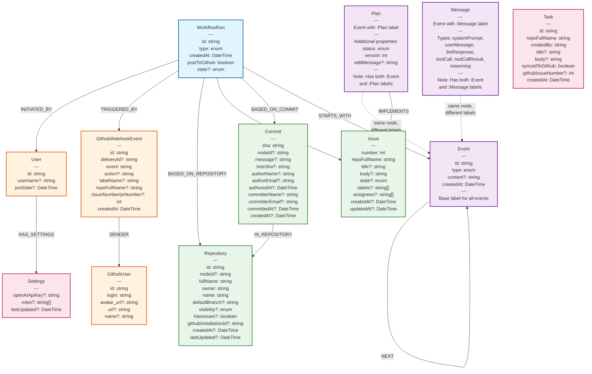
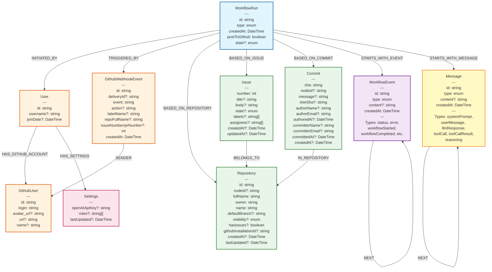

# Neo4j Data Model

## Current data model

```mermaid
graph TB
    %% Core Workflow Entities
    WR[WorkflowRun<br/>---<br/>id: string<br/>type: enum<br/>createdAt: DateTime<br/>postToGithub: boolean<br/>state?: enum]

    %% Actor Nodes
    User[User<br/>---<br/>id: string<br/>username?: string<br/>joinDate?: DateTime]

    GithubUser[GithubUser<br/>---<br/>id: string<br/>login: string<br/>avatar_url?: string<br/>url?: string<br/>name?: string]

    WebhookEvent[GithubWebhookEvent<br/>---<br/>id: string<br/>deliveryId?: string<br/>event: string<br/>action?: string<br/>labelName?: string<br/>repoFullName?: string<br/>issueNumber/prNumber?: int<br/>createdAt: DateTime]

    %% GitHub Entities
    Repo[Repository<br/>---<br/>id: string<br/>nodeId?: string<br/>fullName: string<br/>owner: string<br/>name: string<br/>defaultBranch?: string<br/>visibility?: enum<br/>hasIssues?: boolean<br/>githubInstallationId?: string<br/>createdAt?: DateTime<br/>lastUpdated?: DateTime]

    Issue["Issue<br/>---<br/>number: int<br/>repoFullName: string<br/>title?: string<br/>body?: string<br/>state?: enum<br/>labels?: string[]<br/>assignees?: string[]<br/>createdAt?: DateTime<br/>updatedAt?: DateTime"]

    Commit[Commit<br/>---<br/>sha: string<br/>nodeId?: string<br/>message?: string<br/>treeSha?: string<br/>authorName?: string<br/>authorEmail?: string<br/>authoredAt?: DateTime<br/>committerName?: string<br/>committerEmail?: string<br/>committedAt?: DateTime<br/>createdAt?: DateTime]

    %% Event Timeline (Multi-Label Pattern)
    Event[Event<br/>---<br/>id: string<br/>type: enum<br/>content?: string<br/>createdAt: DateTime<br/>---<br/>Base label for all events]

    Message["Message<br/>---<br/>Event with :Message label<br/>---<br/>Types: systemPrompt,<br/>userMessage, llmResponse,<br/>toolCall, toolCallResult,<br/>reasoning<br/>---<br/>Note: Has both :Event<br/>and :Message labels"]

    Plan[Plan<br/>---<br/>Event with :Plan label<br/>---<br/>Additional properties:<br/>status: enum<br/>version: int<br/>editMessage?: string<br/>---<br/>Note: Has both :Event<br/>and :Plan labels]

    %% Other Entities
    Task[Task<br/>---<br/>id: string<br/>repoFullName: string<br/>createdBy: string<br/>title?: string<br/>body?: string<br/>syncedToGithub: boolean<br/>githubIssueNumber?: int<br/>createdAt: DateTime]

    Settings["Settings<br/>---<br/>openAIApiKey?: string<br/>roles?: string[]<br/>lastUpdated?: DateTime"]

    %% Workflow Initiation Relationships
    WR -->|INITIATED_BY| User
    WR -->|TRIGGERED_BY| WebhookEvent
    WebhookEvent -->|SENDER| GithubUser

    %% Workflow Target Relationships
    WR -->|BASED_ON_REPOSITORY| Repo
    WR -->|BASED_ON_ISSUE| Issue
    WR -->|BASED_ON_COMMIT| Commit

    %% Cross-Entity Relationships
    Commit -->|IN_REPOSITORY| Repo

    %% Event Chain Relationships
    WR -->|STARTS_WITH| Event
    Event -->|NEXT| Event

    %% Note: Message and Plan are not separate nodes
    %% They are Event nodes with additional labels
    Message -.->|"same node,<br/>different labels"| Event
    Plan -.->|"same node,<br/>different labels"| Event

    %% Plan-Issue Relationship
    Plan -->|IMPLEMENTS| Issue

    %% User Settings
    User -->|HAS_SETTINGS| Settings

    %% Styling
    classDef workflowNode fill:#e1f5ff,stroke:#01579b,stroke-width:2px
    classDef actorNode fill:#fff3e0,stroke:#e65100,stroke-width:2px
    classDef githubNode fill:#e8f5e9,stroke:#2e7d32,stroke-width:2px
    classDef eventNode fill:#f3e5f5,stroke:#6a1b9a,stroke-width:2px
    classDef otherNode fill:#fce4ec,stroke:#c2185b,stroke-width:2px

    class WR workflowNode
    class User,GithubUser,WebhookEvent actorNode
    class Repo,Issue,Commit githubNode
    class Event,Message,Plan eventNode
    class Task,Settings otherNode
```

## Ideal data model

```mermaid
graph TB
    %% Core Workflow Entities
    WR[WorkflowRun<br/>---<br/>id: string<br/>type: enum<br/>createdAt: DateTime<br/>postToGithub: boolean<br/>state?: enum]

    %% Actor Nodes
    User[User<br/>---<br/>id: string<br/>username?: string<br/>joinDate?: DateTime]

    GithubUser[GithubUser<br/>---<br/>id: string<br/>login: string<br/>avatar_url?: string<br/>url?: string<br/>name?: string]

    WebhookEvent[GithubWebhookEvent<br/>---<br/>id: string<br/>deliveryId?: string<br/>event: string<br/>action?: string<br/>labelName?: string<br/>repoFullName?: string<br/>issueNumber/prNumber?: int<br/>createdAt: DateTime]

    %% GitHub Entities
    Repo[Repository<br/>---<br/>id: string<br/>nodeId?: string<br/>fullName: string<br/>owner: string<br/>name: string<br/>defaultBranch?: string<br/>visibility?: enum<br/>hasIssues?: boolean<br/>githubInstallationId?: string<br/>createdAt?: DateTime<br/>lastUpdated?: DateTime]

    Issue["Issue<br/>---<br/>number: int<br/>title?: string<br/>body?: string<br/>state?: enum<br/>labels?: string[]<br/>assignees?: string[]<br/>createdAt?: DateTime<br/>updatedAt?: DateTime"]

    Commit[Commit<br/>---<br/>sha: string<br/>nodeId?: string<br/>message?: string<br/>treeSha?: string<br/>authorName?: string<br/>authorEmail?: string<br/>authoredAt?: DateTime<br/>committerName?: string<br/>committerEmail?: string<br/>committedAt?: DateTime<br/>createdAt?: DateTime]

    %% Separate Event and Message Nodes
    Event[WorkflowEvent<br/>---<br/>id: string<br/>type: enum<br/>content?: string<br/>createdAt: DateTime<br/>---<br/>Types: status, error,<br/>workflowStarted,<br/>workflowCompleted, etc.]

    Message["Message<br/>---<br/>id: string<br/>type: enum<br/>content?: string<br/>createdAt: DateTime<br/>---<br/>Types: systemPrompt,<br/>userMessage, llmResponse,<br/>toolCall, toolCallResult,<br/>reasoning"]

    Settings["Settings<br/>---<br/>openAIApiKey?: string<br/>roles?: string[]<br/>lastUpdated?: DateTime"]

    %% User-GitHub Connection
    User -->|HAS_GITHUB_ACCOUNT| GithubUser

    %% Workflow Initiation Relationships
    WR -->|INITIATED_BY| User
    WR -->|TRIGGERED_BY| WebhookEvent
    WebhookEvent -->|SENDER| GithubUser

    %% Workflow Target Relationships
    WR -->|BASED_ON_REPOSITORY| Repo
    WR -->|BASED_ON_ISSUE| Issue
    WR -->|BASED_ON_COMMIT| Commit

    %% Cross-Entity Relationships
    Commit -->|IN_REPOSITORY| Repo
    Issue -->|BELONGS_TO| Repo

    %% Event Timeline (separate chains)
    WR -->|STARTS_WITH_EVENT| Event
    Event -->|NEXT| Event

    WR -->|STARTS_WITH_MESSAGE| Message
    Message -->|NEXT| Message

    %% User Settings
    User -->|HAS_SETTINGS| Settings

    %% Styling
    classDef workflowNode fill:#e1f5ff,stroke:#01579b,stroke-width:2px
    classDef actorNode fill:#fff3e0,stroke:#e65100,stroke-width:2px
    classDef githubNode fill:#e8f5e9,stroke:#2e7d32,stroke-width:2px
    classDef eventNode fill:#f3e5f5,stroke:#6a1b9a,stroke-width:2px
    classDef messageNode fill:#fff9c4,stroke:#f57f17,stroke-width:2px
    classDef otherNode fill:#fce4ec,stroke:#c2185b,stroke-width:2px

    class WR workflowNode
    class User,GithubUser,WebhookEvent actorNode
    class Repo,Issue,Commit githubNode
    class Event eventNode
    class Message messageNode
    class Settings otherNode
```

- The types for these data models should be saved and referenced in the `shared/src/adapters/neo4j/types.ts` file.
